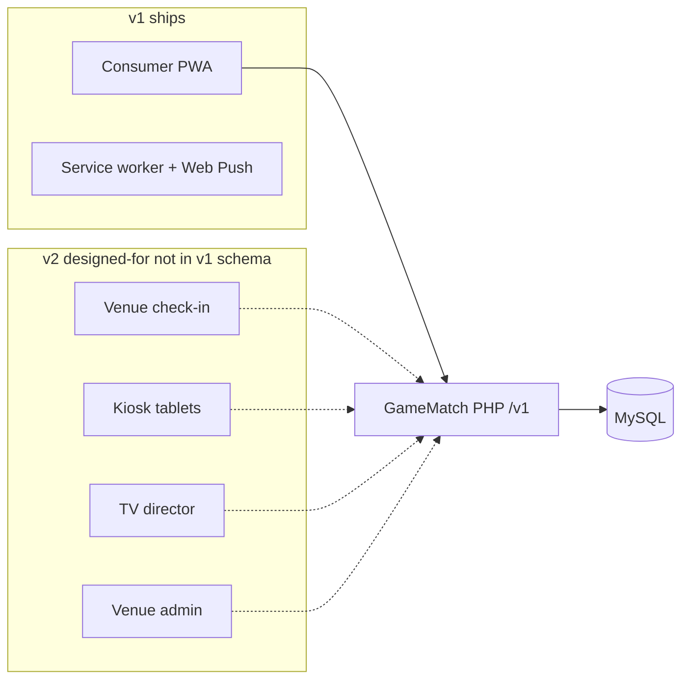
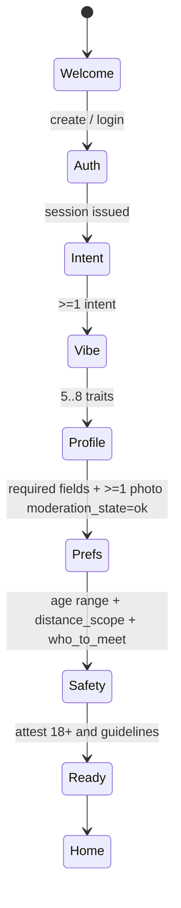
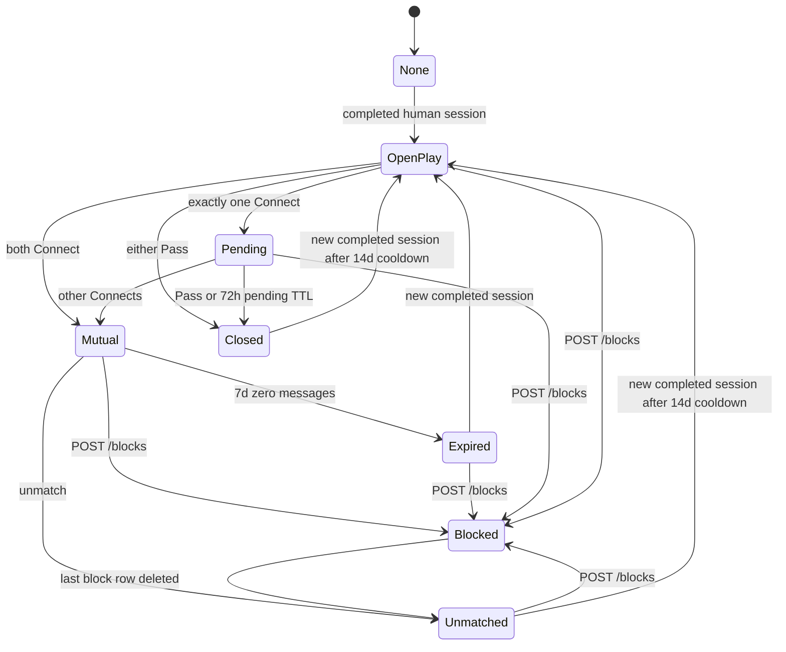
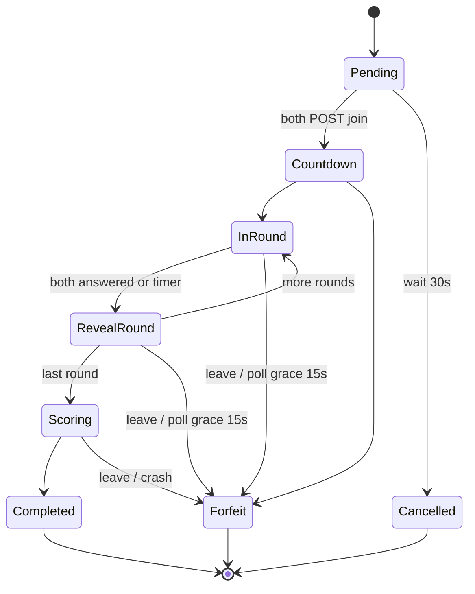
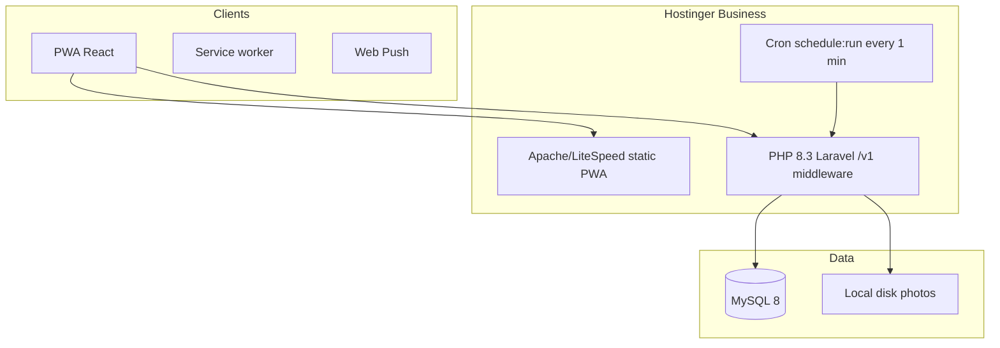
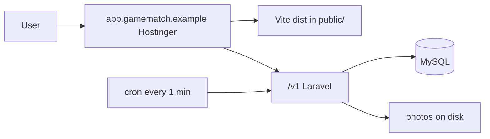
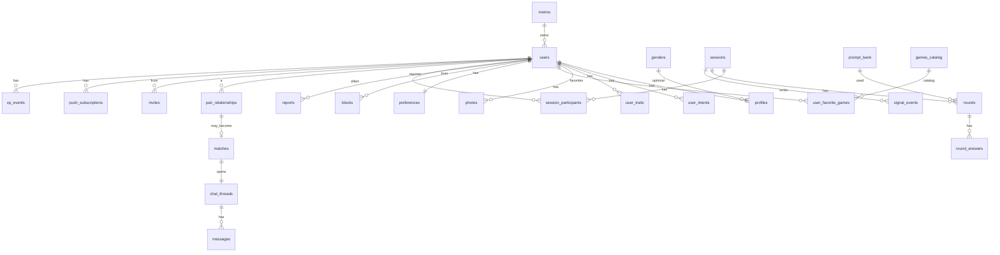
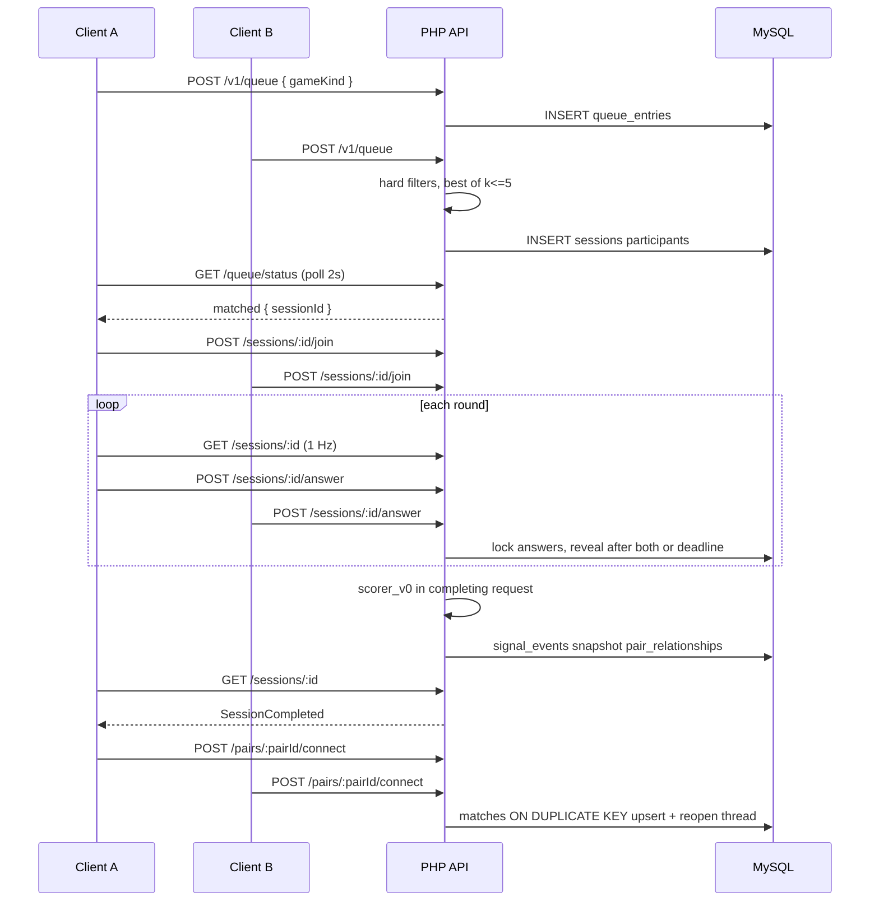
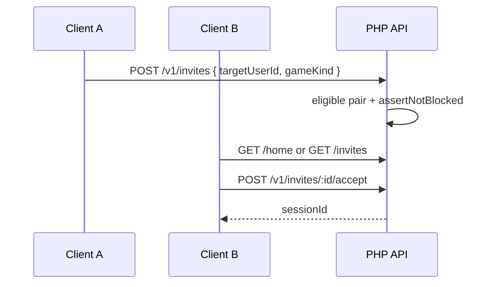

# GameMatch PWA — Implementation Design Document

| Field | Value |
| --- | --- |
| **Title** | GameMatch: play-first dating PWA |
| **Author** | TBD (product + engineering) |
| **Date** | 2026-08-26 |
| **Status** | Draft (revision 7 — Hostinger PHP/MySQL stack override) |
| **Related concepts** | GameMatch (consumer app); Project MatchPoint (barcade + lounge, venue SaaS) |
| **Source material** | Informal GitHub issue #1 notes (wireframes; described as truncated at §28 — **not in git**); GitHub issue #2 investor/venue proposal |
| **Repo** | `game-match-pwa`. **On disk:** `README.md` + `docs/` (this file + `business-proposal.md`). **Git tracks only `README.md` as of this writing.** No application code, lockfile, or stack in the tree. |

This document is the spec of record at `docs/design-docs-and-wireframes.md`. Informal issue notes are not the body of record. Do not assume issue #1 exists in git history.

**How to read decisions:** [Key Decisions](#key-decisions) are **locked for v1**. **OQ-1, OQ-4, and OQ-28 were answered by the user on 2026-08-26** and are final. **OQ-12 / OQ-13 were overridden 2026-08-26:** React PWA + PHP + MySQL on Hostinger Business (not Fly/Hono/Postgres/Redis). Remaining Confirm-the-KD items stay in force. Remaining Open Questions are Later / non-schema.

---

## Overview

GameMatch is a **play-first dating** product: people meet through games, challenges, compatibility questions, and (later) live rooms rather than a swipe deck. Friendship and Gaming are **secondary intents** in a **non-dating pool** (they never mix with Dating). The intended feeling is a barcade night—play, interact, notice chemistry, then match—not a photo marketplace. The core loop is:

**Enter → Build Profile → Play → Meet → Match → Chat → Play Again**

v1 is a **consumer Progressive Web App** with five tabs (`HOME` / `PLAY` / `MATCH` / `CHAT` / `ME`), three synchronous 1:1 icebreaker games, a deterministic **`scorer_v0`**, mutual opt-in matching, contextual chat, and a safety floor (bidirectional block for discovery, report, hide, incognito, coarse location, no public availability labels). **HOME is a game lobby, not a people deck.** Discovery is **queue-first**; targeted Play is an **invite** to someone you already played with or matched—not a stranger from a grid.

Venue tablets, TV group games, and venue-owner SaaS are **out of the v1 binary and out of v1 migrations**. Identity and chat are shaped so those surfaces can attach later.

---

## Background & Motivation

### Current state

The repo has no product code. Two markdown sources exist **on disk** (docs/ may be untracked):

- This path previously held an informal issue #1 dump: product philosophy, ASCII wireframes, game modes, scoring sketch, safety list, monetization, architecture tree said to be cut at §28.
- `docs/business-proposal.md` (issue #2): Project MatchPoint venue economics, tablet guest journey, consent rules, and **never publicly label someone as single, available, rejected, or unmatched**.

Several ideas conflict (TV copy “WHO’S SINGLE?” vs anti-labeling). Scoring weights were illustrative. This revision makes v1 **buildable**: geo primitive, gender schema, targeted-play API, complete `scorer_v0`, game protocols, and a PR order that matches dogfood.

### Why this exists

Traditional dating apps optimize for photos and volume. Pain: swipe → “hey” → death; public meeting is high-friction; venues have co-located people with no consentful “open to meeting” that is not a broadcast of availability.

Differentiator: **interaction before inbox**. Games are icebreakers and behavioral sensors. MatchPoint is a physical distribution channel for the same engine, not a different v1 product.

---

## Goals & Non-Goals

### Goals (v1 PWA)

1. Installable **dating** PWA: onboard → live 1:1 game (queue or invite) → post-game reveal → mutual Connect → chat with icebreaker → challenge / play again. Friendship/Gaming users exist in a **separate non-dating pool** (KD-12).
2. **Play-first:** no swipe-first home feed. Photos exist on **own and already-played** profiles; they are not the ranking primitive and are **not** a stranger deck on HOME.
3. Persist **game-behavior signals** and compute **explainable `scorer_v0`** (no ML).
4. Safety floor: 18+ self-attest, bidirectional discovery block, report (CSAM freeze path), hide, incognito (always free), match expiration, no exact location, no public single/rejected labels.
5. Later-attach venue/tablet/TV **without v1 unused tables**.
6. Honest v1 monetization: **free**; no payments; no `see_likes` entitlement stub.

### Non-goals (v1)

- Native apps, app stores.
- Tablets, QR-controller, TV director, POS.
- Venue admin, event scheduling, tablet fleet.
- Arcade physics ports. Trivia = prompt bank + timers only.
- ML recs, beauty scores, hidden graphs.
- Photo verification ML, government ID KYC (column hook only).
- 24/7 human mods (stub queue + freeze path).
- Payments, sponsored trivia, featured venues, “who liked you”.
- Background location, async/offline multiplayer, live rooms.
- Minors / 13–17 SKU.
- Debug “pair with user id” in any production/beta binary.

### Later (deferred)

| Horizon | What | Why deferred |
| --- | --- | --- |
| v1.1 | Live rooms (4–24), icebreaker A/B, account export job polish | Needs working 1:1 loop |
| v2 | Venue check-in, QR, tablets, TV director, venue admin | Needs a real venue |
| v2 | GameMatch+ payments, rewind, **priority queue** (not who-liked-you unless OQ-11 is yes) | After retention |
| v2 | Incognito *extra stealth* as Plus — **base incognito stays free** (KD-15) | Safety exception |
| v3 | Venue SaaS, branded tablets, sponsored rounds | B2B |

---

## Key Decisions

Locked for v1. Confirm-the-KD questions in Open Questions do **not** reopen these unless the user overrides them.

| ID | Decision | Rationale |
| --- | --- | --- |
| **KD-1** | **v1 = consumer PWA only.** No venue/tablet/TV UI. **No v1 migrations for venue tables.** | Empty repo; no location. |
| **KD-2** | **Play-first, queue-first discovery.** HOME is a lobby (queue CTA + live depth). **No stranger photo deck, no cold percents.** Match only after **mutual Connect** following a **completed** shared session. | Source philosophy without Tinder skin; closes availability leak of faces+94%. |
| **KD-3** | **Mutual Connect** (wireframe “Send message”). Chat only when both Connect. **Pass is silent** (no notification, no “they passed”). | Consent; anti-shame. |
| **KD-4** | **No public availability labels** in product UI or TV copy: never “single”, “rejected”, “unmatched”, “who passed”. Venue presence (v2) is opt-in and coarse (“At THE HIVE”). **Venue “Singles Night” is event marketing copy, not a guest flag or in-app label.** No TV “WHO’S SINGLE?”. | **OQ-28 resolved 2026-08-26: kill in-product “WHO’S SINGLE?”.** |
| **KD-5** | **`scorer_v0` is a documented pure function.** Show reason chips; show percent **only after a completed shared game** and only if both have enough signals. **No 50–99 clamp.** Percent = `round(score * 100)` of renormalized 0–1. | Fake clamp was dishonest (R3). |
| **KD-6** | **Do not score** attractiveness, race, body, income, exact GPS, win rate as desirability, XP/matches, orientation-as-bonus. | Ethics + anti-popularity-spiral. |
| **KD-7** | **HTTPS REST + short-poll** for sessions, chat, presence, queue. **No WebSocket in v1.** Game deadlines are server `answer_by` timestamps; clients poll `GET /sessions/:id` at 1 Hz while a round is open. | Hostinger Business shared PHP has no durable WS process. |
| **KD-8** | **MySQL** is the system of record **and** the ephemeral store (queue rows, session docs, presence). **No Redis.** Append-only `signal_events`. | Hostinger web hosting: MySQL yes; Redis/Postgres require VPS. |
| **KD-9** | **v1 stack locked (user override 2026-08-26):** Vite + React 19 + TypeScript PWA, **TanStack Router**, TanStack Query, Zustand, Tailwind, `vite-plugin-pwa`, pnpm for `apps/web`. **PHP 8.3 + Laravel 11** as the API/middleware (`apps/api`): Sanctum SPA cookies, Eloquent, scheduler. **MySQL 8** on Hostinger. Auth: **Laravel Sanctum** + Twilio OTP + Socialite (Apple/Google). Photos on **Hostinger disk**. **Host: Hostinger Business** (same origin: static PWA + PHP `/v1`). Composer for PHP. **No Fly, no Hono, no Postgres, no Redis, no R2, no Better Auth.** | User: serve the React PWA against PHP middleware on MySQL, all on Hostinger Business. |
| **KD-10** | **App age floor 18.** Venue 21+ is door policy, not the PWA SKU. Self-attest + DOB in v1. Counsel before public. | **OQ-4 resolved 2026-08-26: 18+.** |
| **KD-11** | **v1 matcher is metro-scoped, not mile-radii.** Catalog `metros` (centroid/bbox/adjacent **admin-only, never in public JSON**). User picks a metro; optional one-shot geo only **suggests** which metro (then dropped). Preference: `distance_scope` = `metro` \| `metro_and_adjacent`. Optional `approx_geohash` precision 5 may be stored for a later mile-band feature; **v1 does not haversine it.** Never persist raw GPS, never log lat/lng. | City-picker users share a centroid hash; fake 10/25/50 mile UI would be a no-op. |
| **KD-12** | **Primary job is dating.** If **either** user has intent `dating`, **both** must have `dating`. Dating+Gaming may pair with Dating-only. Dating must **not** pair with Friendship-only or Gaming-only. Socializing is **not** a bridge into the dating pool. If **neither** has `dating`, Friendship / Gaming / Socializing may pair (non-dating pool). Normative `intentsOk` lives next to `genderOk`. | **OQ-1 resolved 2026-08-26: dating-with-games.** Friendship/Gaming are secondary. |
| **KD-13** | **Three games only:** This or That, 20 Questions (**pick-list**), Guess My Answer. No Duo Trivia / rooms / arcade in v1 `GameKind`. | Implementable; pick-list avoids UGC mods. |
| **KD-14** | **Match expires 7 days after mutual with zero messages.** Chat locks. Unmatch anytime. Idle chat does **not** auto-expire in v1. **Re-queue / invite cooldown:** Pass or Unmatch → 14 days (`pair.cooldown_until`). **Expired matches may re-queue and invite immediately** (inactivity, not rejection). | Distinguishes rejection from timeout. |
| **KD-15** | **Incognito is always a free safety control** (hide from queue/lobby). Existing chats and in-flight sessions remain. Plus must not remove it. | Safety > monetization. |
| **KD-16** | XP/levels/badges **participation-based**, server-authoritative, not a matcher input. | Source §20–21. |
| **KD-17** | **English, one US metro** at a time (allowlist). | No i18n platform. |
| **KD-18** | **In-app brand: GameMatch.** MatchPoint = venue/investor name. | One chrome. |
| **KD-19** | **Matcher: minimize wait, no score floor.** On every `POST /queue` and `GET /queue/status`: hard-filter (including `distance_scope`) → take **best of k=5** by `scorer_v0` pair score, or **0.5** if percent would be hidden. If pool empty, **expand to adjacent metros** (even if a user chose `metro` only) after **32s wait** (from `queue_entries.enqueued_at`). Never violate block/intent/age/gender/incognito/cooldown. No background 8s daemon. | Cold start; Hostinger has no always-on matcher loop. |
| **KD-20** | **Targeted play = `POST /v1/invites`** `{ targetUserId, gameKind }` only if the pair has a **prior completed session, open pair_relationship, or mutual match**. TTL 2 min. **No cold invite of strangers. No production debug pair-by-id.** `staff.force_pair` **on in staging only, off in beta/prod**. | Makes Play-with-Alex real without a deck. |
| **KD-21** | **Gender / who-to-meet:** optional self-label from `genders` catalog (including “prefer not to say”); **`who_to_meet` multi-select** of gender ids **or** `open` (= everyone). **No default heterosexual pairing.** Orientation is **not collected in v1**. Matcher applies **each side independently**: if A is not open, B.`gender_id` must be in A’s list (**null gender on B → no match**). If A is open, A imposes no gender constraint. Same for B. **Do not skip B’s filter because A is open.** Empty `who_to_meet` with `who_to_meet_open=true` is the default. | Choosier user’s list is never discarded. |
| **KD-22** | **One Hostinger site is the origin.** Document root serves the Vite PWA; Laravel handles `/v1/*`. **Sanctum SPA session cookie** (`httpOnly`, `Secure`, `SameSite=Strict`, same origin). No access JWT, no `/ws`, no CORS for the PWA. **Signed photo GET URLs TTL 10 minutes** (Laravel signed routes over files on disk). Messages **plain text**. CSP: `default-src 'self'`; `script-src 'self' https://challenges.cloudflare.com` (Turnstile); `connect-src 'self' https://*.sentry.io`; `img-src 'self' blob:`; `frame-src https://challenges.cloudflare.com`. Optional `www` redirect to `app`. | Same host is what Hostinger Business actually gives you. |
| **KD-23** | **20 Questions v1 = 4-choice pick-list**, not free text. | OQ-10/OQ-23: no mod staff on day one. |
| **KD-24** | **Percents never on HOME or queue.** Queue shows wait estimate only, never “82% potential.” | Demand + identity leak. |
| **KD-25** | **Connect is per unordered pair.** `pair_relationships.id` is UUIDv7. `POST /pairs/:pairId/connect`. Latest **completed** human session can Connect/Pass. Forfeit/cancelled/practice cannot. **`matches` is one row per pair for life** (`UNIQUE (user_a,user_b)`). Mutual = `INSERT … ON DUPLICATE KEY UPDATE` (`state=mutual`, new `origin_session_id`/`expires_at`, clear `unmatched_by`). **One `chat_threads` row per match**; reopen on rematch (`state=open`) with a `kind=system` divider — do not insert a second thread and do not pretend the unmatched window never happened. Icebreaker fires on **transition into mutual**, not on SQL insert. New completed human session while `unmatched\|expired\|closed` and cooldown past: `state=open_play`, `a_action=b_action=none`, `pending_expires_at=null`. Pair `state` is pair-centric (`open_play\|pending\|mutual\|closed\|unmatched\|expired\|blocked`). | Second Mutual must not UNIQUE-crash; leftover Pass must not block Connect. |
| **KD-26** | **Games are live-only** (both WS-connected). **Practice vs house:** offer at **30s** wait; at **90s** S09 must show Practice vs keep-waiting (matches starve SLO). Practice writes no pair `signal_events` and cannot Connect. | R1 without poisoning scores. |
| **KD-27** | **Feature flags + phone allowlist ship before onboarding is public** (PR train). Dogfood requires flags + delete + reports, not only the happy loop. | Prevents open OTP+photos with no gate. |
| **KD-28** | **Block is bidirectional hide** for queue, invites, profile GET, session join, chat, HOME, **`GET /pairs`, `GET /pairs/:id`, `GET /home` pending/invites, Connect.** Notified: never. `assertNotBlocked(a,b)` iff no `blocks` row either direction. If a `matches` row exists, set `matches.state=blocked` and **lock the thread** (same as unmatch). **Not a Pass** (no `closed` / no “you passed” row for the other party). **Unblock:** delete your row; if the other still blocks you, still blocked. When **no** block remains: `matches.state=unmatched`, pair `state=unmatched`, `cooldown_until=now()+14d`, thread stays locked until they play after cooldown (unmatched-equivalent, not immediate invite). | MATCH faces must not survive a block. |
| **KD-29** | **Photo v1 pipeline:** MIME/magic sniff, size cap, **server re-encode WebP**, **strip EXIF/GPS**, 1080 + 320 + blurhash. CSAM/underage report → **immediate freeze**. Counsel + NCMEC **18 U.S.C. §2258A** path before **public** launch (not required to invent legal copy in engineering PRs). | Closed beta still stores photos. |
| **KD-30** | **v1 game authority is request-driven PHP + MySQL session rows (TTL 2h).** Each poll/POST loads the row, applies deadlines, writes, returns `RoundView`. PHP workers are on-demand (no long-lived daemon). Matcher runs **on queue POST/poll** (enqueue time drives the 8s/32s expand). Hostinger cron (`* * * * * php artisan schedule:run`) is the backstop for forfeits, expiry, and starve — **not** the 8s game clock. | Shared hosting cannot keep a Node/WS process alive. |
| **KD-31** | **Account deletion:** immediate PII wipe **unless** a **legal hold** is active. Hold is created on `csam`/`underage` report (freeze). `DELETE /me` then returns **409** until mod/counsel releases the hold. Held: encoded photos + cited `message_ids` + report row, TTL **90 days after hold release** (or 1 year from report, whichever first). Otherwise: wipe profile/photos/bodies/DOB/email/encrypted phone; tombstone `users.id`; banned `phone_e164_hash` 12 months; other open reports 90 days then subject nulled. **No 30-day cool-off.** | Wipe must not beat CSAM evidence. |
| **KD-32** | **Public `last_active_on` is a UTC date**, not a minute timestamp. Internal `last_seen_at` is not in public APIs. | Presence stalking. |
| **KD-33** | **Supported clients:** Chrome/Android (installable), **Safari iOS 16.4+ Add to Home Screen**, desktop Chromium **best-effort**. SMS/email **not** used for match notify in v1 (Web Push + in-app only). | iOS limits; no extra vendor. |

---

## Product surfaces and v1 cut



### Screen inventory (v1)

Bottom nav after onboarding except **full-screen game** (explicit Leave). Manifest **`start_url=/boot`**: reads session + `onboarding_step`, redirects to the correct S0x or `/home`. Never land incomplete users on `/home`.

| ID | Route | Tab | Purpose | Auth |
| --- | --- | --- | --- | --- |
| S00 | `/boot` | — | Resume gate (manifest start) | either |
| S01 | `/welcome` | — | Create account / log in | public |
| S02 | `/onboarding/intent` | — | Multi-select intents | authed |
| S03 | `/onboarding/vibe` | — | 5–8 traits | authed |
| S04 | `/onboarding/profile` | — | Name, DOB, photos, bio, favorite games, **metro picker** | authed |
| S05 | `/onboarding/prefs` | — | Age range, city vs nearby metros, who-to-meet | authed |
| S06 | `/onboarding/safety` | — | 18+ attest, guidelines, optional one-shot geo to *suggest* metro | authed |
| S07 | `/home` | HOME | Queue CTA, live queue-depth, **your** pending reveals/invites — **no stranger faces** | authed |
| S08 | `/play` | PLAY | Catalog, queue, invites to known pairs | authed |
| S09 | `/play/queue` | PLAY | Wait estimate, cancel, practice-vs-house offer at 30s | authed |
| S10 | `/play/session/:id` | — | Full-screen game | authed |
| S11 | `/play/reveal/:sessionId` | — | Score (if eligible), reasons, Connect / Pass / Play again | authed |
| S12 | `/match` | MATCH | `GET /pairs`: mutual, waiting Connect, played-with faces | authed |
| S13 | `/u/:id` | — | Profile if **not blocked** and (self or prior session or match). Else 404 | authed |
| S14 | `/chat` | CHAT | Inbox | authed |
| S15 | `/chat/:threadId` | CHAT | Thread + icebreakers + Challenge | authed |
| S16 | `/me` | ME | Preview, XP, settings | authed |
| S17 | `/me/settings` | ME | Notifications, incognito, hide, delete | authed |
| S18 | `/me/safety` | ME | Blocks, reports | authed |
| S19 | `/legal/*` | — | ToS, privacy, guidelines | public |

**Not in v1:** `/venue/:slug`, `/kiosk`, `/tv/:eventId`, `/admin`.

### Information architecture (v1 shipped nodes)

```
GameMatch
├── Welcome / Auth
├── Onboarding (Intent → Vibe → Profile → Prefs → Safety)
└── App shell
    ├── HOME — Lobby (queue + depth + your pending)
    ├── PLAY — Catalog, queue, session, reveal
    ├── MATCH — Mutual / waiting / session history (faces of played-with)
    ├── CHAT — Threads, icebreakers, invites
    └── ME — Profile, XP, settings, safety
```

Completed architecture tree from the truncated source diagram. **This is IA, not a v1 deployment map.** Node suffixes are ship horizon.

```mermaid
flowchart TB
  GM[GameMatch]
  GM --> DISCOVER
  GM --> PLAY
  GM --> MATCH
  GM --> CHAT
  GM --> ME
  GM --> SAFETY
  GM --> VENUE[Venue v2]

  DISCOVER --> Queue["Queue v1"]
  DISCOVER --> Profiles["Played-with profiles v1"]
  DISCOVER --> Rooms["Rooms v1.1"]
  DISCOVER --> Venues["Venues v2"]

  PLAY --> Games["Games v1"]
  PLAY --> Challenges["Invites v1"]
  PLAY --> Sessions["Sessions v1"]
  PLAY --> Events["Events v2"]

  MATCH --> Compatibility["Compatibility v1"]
  MATCH --> Reveal["Reveal v1"]
  MATCH --> MutualOptIn["Mutual Connect v1"]
  MATCH --> Recommendations["Recommendations v1.1"]

  CHAT --> Threads["Threads v1"]
  CHAT --> Icebreakers["Icebreakers v1"]
  CHAT --> InChatChallenges["In-chat invites v1"]

  ME --> Settings["Settings v1"]
  ME --> XPBadges["XP / badges v1"]
  ME --> Prefs["Preferences v1"]

  SAFETY --> BlockReport["Block/report v1"]
  SAFETY --> AgeVerify["Attest v1 / KYC v2"]
  SAFETY --> Incognito["Incognito v1"]
  SAFETY --> ModerationQueue["Mod queue v1 minimal"]

  VENUE --> CheckIn["Check-in v2"]
  VENUE --> Tablets["Tablets v2"]
  VENUE --> TVDirector["TV director v2"]
  VENUE --> VenueAdmin["Venue admin v2"]
```



---

## Experience philosophy (normative)

| Traditional app | GameMatch |
| --- | --- |
| Photo → Swipe → Match → “Hey” | Profile → **Queue/Invite game** → Personality → Chemistry → Connect → Conversation |
| Rank by looks | Rank by intent + explainable overlap **after play** |
| Infinite deck | Queue + finite sessions |
| Ghosting default | Expiration + Play Again; Pass silent |

Chat opens on a **shared session fact**, not an empty composer as the only path.

---

## Wireframes (preserved and completed)

Visual: dark neon arcade × lounge; large type; purple / pink / blue tokens; AA text contrast (glow is decoration). Voice: playful, confident, flirty, social.

ASCII below is **source-faithful where possible**; **v1 behavior notes** override source when they conflict (people deck, percents on HOME, free-text 20Q, “38 SINGLES”).

### Main navigation

```
┌─────────────────────────────────────┐
│            APP CONTENT              │
├─────────────────────────────────────┤
│  HOME    PLAY    MATCH    CHAT    ME│
└─────────────────────────────────────┘
```

### S01 — Welcome

```
┌───────────────────────────┐
│        GAMEMATCH          │
│    Meet someone.          │
│    Play something.        │
│    See what happens.      │
│    [ CREATE ACCOUNT ]     │
│    Already a member? LOG IN│
└───────────────────────────┘
```

### S02 — Intent (multi-select, ≥1)

```
┌───────────────────────────┐
│ What brings you here?     │
│  ❤️ Dating                │
│  👥 Friendship            │
│  🎮 Gaming                │
│  🥂 Socializing           │
│        [ CONTINUE ]       │
└───────────────────────────┘
```

Multi-select, ≥1. **Dating is the primary job.** Selecting Dating (alone or with Gaming/Friendship/Socializing) puts the user in the **dating pool**: they only match others who also selected Dating (KD-12). Users who omit Dating stay in the **non-dating pool**.

### S03 — Vibe (5–8 from server `traits`)

```
WHAT'S YOUR VIBE?
🔥 Competitive   😂 Funny        🎨 Creative
🌙 Night Owl     🎵 Music Lover  🏋️ Active
🍻 Social        🧠 Nerdy        ❤️ Romantic
😈 Chaotic
```

Each trait has exactly one **axis** (`personality` | `lifestyle` | `interest`) so scoring does not double-count (see scorer).

### S04 — Profile

```
┌───────────────────────────┐
│        YOUR PROFILE       │
│        [ PHOTO ]          │
│    Name, Age              │
│    City / metro (picker)  │
│    "I'm usually..."       │
│ Favorite Games            │
│ [ Trivia ] [ Pool ] …     │
│        [ SAVE ]           │
└───────────────────────────┘
```

Rules: 1–6 photos; display name 2–24; DOB stored, **age displayed**; metro from catalog (not free-text GPS); bio 0–160; favorite games max 8 from catalog. **Save/Continue disabled until ≥1 photo `moderation_state=ok`.**

### S05 — Preferences (was missing as ASCII)

```
┌───────────────────────────┐
│ WHO DO YOU WANT TO MEET?  │
│ Age  [ 24 ] — [ 40 ]      │
│ Where should we look?     │
│  ( ) My city only         │
│  ( ) My city + nearby     │
│ Open to: [Everyone] or    │
│   chips from genders      │
│        [ CONTINUE ]       │
└───────────────────────────┘
```

No mile radii in v1 UI (KD-11). “Nearby” = `metros.adjacent_metro_ids`.

### S06 — Safety attest: 18+, guidelines, optional “Use my approximate location to pick a city” (one-shot). Deny → stay on manual metro.

### S07 — Home (source deck shown; **v1 ships lobby**)

Source wireframe (historical):

```
┌───────────────────────────┐
│ ☰           GAMEMATCH   🔔│
│ 🔥 LIVE NOW               │
│ │   SPEED DATING GAME   │ │
│ │   12 PLAYERS          │ │
│ PEOPLE NEAR YOU           │
│  👩 Sarah      94% Match  │
│ [ PLAY ] [ MATCH ]        │
└───────────────────────────┘
```

**v1 HOME (normative):**

```
┌───────────────────────────┐
│ ☰           GAMEMATCH   🔔│
│ 🔥 PLAY NOW               │
│ ┌───────────────────────┐ │
│ │  1:1 THIS OR THAT     │ │
│ │  4 waiting in LA      │ │
│ │  [ FIND SOMEONE ]     │ │
│ └───────────────────────┘ │
│ YOUR MOVES                │
│  Alex — waiting on Connect│
│  Invite from Sam · Trivia │
└───────────────────────────┘
```

12-player speed dating is **v1.1 rooms**, not v1. **[ FIND SOMEONE ]** → `POST /queue { gameKind: "this_or_that" }` (HOME default). Other kinds: PLAY catalog (S08). iOS A2HS: first-run ME tooltip “Add to Home Screen for notifications” — not on Welcome.

### S10a — 20 Questions (pick-list; source had free text)

```
┌─────────────────────────────┐
│     QUESTION 3 OF 6         │
│ What would you do with      │
│ $10,000?                    │
│  A Motorcycle               │
│  B Trip                     │
│  C Save it                  │
│  D Something chaotic        │
│         00:18               │
└─────────────────────────────┘
```

Simultaneous reveal; “SAME ENERGY” if same choice.

### S10b — This or That

```
┌─────────────────────────────┐
│         THIS OR THAT        │
│        BEACH 🏖️  VS  MOUNTAINS 🏔️
│        [ TAP ]   8 SECONDS  │
└─────────────────────────────┘
```

### S11 — Reveal

```
┌─────────────────────────────┐
│         GAME OVER           │
│        YOU + ALEX           │
│         ❤️ 72%              │  ← only if enough signals
│        COMPATIBLE           │
│    🎮 Similar Game Style    │
│    🎵 Similar Music         │
│    😂 Same Humor            │
│ [ CONNECT ]  [ PASS ]       │
│ [ PLAY AGAIN ]              │
└─────────────────────────────┘
```

Insufficient signals: hide percent, keep chips or “Play more to see chemistry.” **No clamp to 50–99.** Play Again: 30s both-present rematch, else `POST /invites` (2 min TTL).

### S15 — Chat: icebreaker from last session (“You both picked tacos…”). Chips `ME` / `THEM` / `LET’S COMPETE` are **messages of kind icebreaker**, plain text.

### S08/S15 — Challenge overlay (v1: three icebreakers; others “Soon”)

### S09 — Queue

```
YOU'RE IN THE QUEUE
❤️ Dating  🎮 Gaming
📍 My city + nearby
Estimated wait: ~30 seconds
[ CANCEL ]
```

At **30s**: show `[ PRACTICE VS HOUSE ]` (KD-26). At **90s**: copy “Still quiet. Keep waiting or practice.” buttons `[ KEEP WAITING ]` `[ PRACTICE ]`. Keep-waiting stays in the same MySQL `queue_entries` row; no match is faked. **No** “Potential matches 82%” bar.

### Deferred v2 wireframes

Venue: “38 PEOPLE HERE” never “38 SINGLES.” Tablet: QR; kiosk credential. TV: “WHO’S IN?” not “WHO’S SINGLE?”. Event posters may say “Singles Night” **off-platform**; the app does not badge attendees.

---

## State machines

### Onboarding



`users.onboarding_step` is source of truth. `/boot` honors it.

### Pair relationship (Connect aggregator)



Stored `pair_relationships.state` is **pair-centric**: `open_play | pending | mutual | closed | unmatched | expired | blocked`. UI “waiting on them” = `state=pending` AND viewer’s action is `connect` (the other action is `none`). Never store `you_pending`/`them_pending`. Never leak Pass to the other client (`theyConnected` is the only peer bit).

**Silent Pass + block visibility (normative, list and detail):**

- `GET /pairs` and `GET /home` pending/invites: omit row if `assertNotBlocked` fails **or** (`state=closed` AND `yourAction !== "pass"`) **or** `state=blocked`.
- **`GET /pairs/:pairId` → 404** in those same cases (no `closed` body for the non-passer; no MATCH thumb after block).
- `POST /pairs/:pairId/connect` and Pass: require `assertNotBlocked` (else **404**, not a Pass oracle) **and** `state ∈ {open_play, pending}`; otherwise **409 `{ "error": { "code": "closed" } }`** with **no** mention of Pass or who acted.

`session_participants` does **not** own match creation. Forfeit / cancel / practice → do not move the pair to `open_play` from that session. 72h pending TTL with no second Connect → `closed` + 14d cooldown (treat as abandoned, not a notified Pass).

**Re-open after Unmatch / Expire / Closed (KD-25):** when a **new completed human session** finishes and `cooldown_until` is past (or null for `expired`):

1. `pair_relationships`: `state=open_play`, `a_action=b_action=none`, `pending_expires_at=null`, `last_completed_session_id=new`, `cooldown_until=null`.
2. Second Mutual: `INSERT INTO matches … ON DUPLICATE KEY UPDATE state='mutual', origin_session_id=VALUES(origin_session_id), matched_at=NOW(), expires_at=NOW() + INTERVAL 7 DAY, unmatched_by=NULL`. **Never a second matches row.**
3. Existing `chat_threads` (`match_id` unique): set `state=open`. Insert `kind=system` body `You matched again after a break.` as a **divider**. Older messages remain in history **below** the divider (honest transcript, not a wipe and not a seamless continuation).
4. Icebreaker: insert `kind=icebreaker` because **state transitioned into mutual**, even if the matches row already existed.

### Game session



- **Countdown:** 3s (`countdown_ms=3000`).
- **RevealRound dwell:** 4s then next (`reveal_ms=4000`).
- **Poll grace:** 15s without `GET /sessions/:id` or heartbeat POST → forfeit. Tab-switch is OK if the PWA keeps polling; background iOS will forfeit (honest).
- **MySQL session row TTL 2h.** Authority loads the row; if missing and not already terminal, session **forfeit**.
- **Play Again 30s:** both still on S11 → new session `mode=invite` auto-accepted. If one left: remaining client `POST /invites`.

### Chat thread

Locked until `matches.state=mutual`. Block → hidden, no push, no delivery.

---

## Proposed design (system architecture)



**v1 process model (KD-30):** Laravel request = the process. Middleware stack: Sanctum session → throttle → feature flags → route. Game authority and `scorer_v0` run **inside the request that closes a round or completes a session** (still synchronous before the JSON body). Matcher runs on `POST /queue` and `GET /queue/status`. Photo encode is **synchronous GD/Imagick in the upload request** (no second worker machine). Hostinger cron is expiry/forfeit backstop only.

**Authoritative game state in MySQL.** Clients render. Deadlines are `answer_by` ISO from server clock.

**Hostinger Business limits (normative):** ~2 vCPU, 3 GB RAM, 50 GB NVMe, 60 PHP workers, 75 MySQL connections/user, 3 GB DB size, PHP max execution 360s. Redis/Postgres **not** on this plan. Node.js “web apps” on Business **sleep when idle** — do **not** use them for game authority.

### Expected load (planning)

`ASSUMPTION`: **5k registered**, **500 DAU**, **20 concurrent game sessions**, chat **< 5 msgs/s**. Stay inside 60 PHP workers: in-round poll is **1 Hz per player**, not faster.

| Resource | Estimate |
| --- | --- |
| MySQL | plan cap **3 GB** per DB; year-1 target **< 2 GB** |
| Signal events | ~45k rows/day at 500 DAU × 3 games |
| Latency | REST p95 `< 500ms` (shared hosting) |
| Photos | re-encoded WebP on disk; 3 sizes |

### SLO (closed beta, same load)

| SLO | Target |
| --- | --- |
| API availability | 99.0% monthly (beta-grade) |
| REST p95 | < 500ms |
| Session forfeit rate | < 20% of starts (alert at 20%) |
| Queue starve (90s no pair, excluding off-hours) | < 40% in launch metro |
| Report first-look | 24h (human); CSAM freeze immediate |

---

## Tech stack recommendation

**Locked (KD-9).** User overrode Fly/Hono/Postgres on 2026-08-26.

| Layer | Choice (v1, one name) |
| --- | --- |
| Client | Vite + React 19 + TypeScript |
| Routing | **TanStack Router** |
| UI | Tailwind + CSS tokens |
| Client data | TanStack Query + Zustand for live session (poll, not WS) |
| PWA | `vite-plugin-pwa` |
| Frontend pkg | pnpm `apps/web` |
| API | **PHP 8.3 + Laravel 11** (`apps/api`) — HTTP middleware: Sanctum, throttle, flags |
| PHP pkg | Composer |
| Shared types | `packages/shared` TypeScript; PHP DTO mirrors in `app/Data` |
| ORM | **Eloquent** |
| DB | **MySQL 8** (Hostinger managed) |
| Queue / cache | **MySQL tables** (`queue_entries`, `sessions`, `cache`); no Redis |
| Files | Hostinger disk `storage/app/photos` |
| Auth | **Laravel Sanctum SPA**; Twilio OTP; Socialite Apple/Google |
| Host | **Hostinger Business** — one origin: static PWA + PHP `/v1` |
| Cron | Hostinger cron every minute: `php artisan schedule:run` |
| Obs | Sentry PHP + browser; Laravel logs |
| Email | Hostinger SMTP — **transactional account only**, not match notify (100/day plan cap) |

**No WebSocket. No Redis. No Fly. No second compute process.** Node.js on Hostinger Business sleeps when idle — the PWA is a **static Vite build**, not a Node server.

**Hosting (normative with KD-22):**



```ts
// packages/shared/src/session.ts
export type SessionState =
  | "pending" | "countdown" | "in_round" | "reveal_round"
  | "scoring" | "completed" | "forfeit" | "cancelled";

export type GameKind = "this_or_that" | "twenty_questions" | "guess_my_answer";

export type SessionMode = "queue_1v1" | "invite" | "practice";

export interface ServerDeadline {
  answerBy: string;
  serverNow: string;
}

export interface ThisOrThatPrompt {
  promptId: string;
  left: { id: string; label: string; tags: string[] };
  right: { id: string; label: string; tags: string[] };
}

export interface TwentyQPrompt {
  promptId: string;
  question: string;
  options: { id: string; label: string; tags: string[] }[]; // length 4
}

export interface GuessPrompt {
  promptId: string;
  question: string;
  options: { id: string; label: string; tags: string[] }[]; // length 4
  yourRole: "answerer" | "guesser";
}

export interface RoundView {
  index: number;
  total: number;
  kind: GameKind;
  prompt: ThisOrThatPrompt | TwentyQPrompt | GuessPrompt;
  deadline: ServerDeadline;
  youSubmitted: boolean;
  opponentSubmitted: boolean;
  phase?: "answer" | "guess";
}

export type PairState =
  | "open_play" | "pending" | "mutual" | "closed" | "unmatched" | "expired" | "blocked";

export interface SessionStateEvent {
  sessionId: string;
  state: SessionState;
  resumeToken: string; // minted on successful session.join; MySQL sessions.ttl 2h
  youSeat: 0 | 1;
}

export interface SessionCompleted {
  sessionId: string;
  pairId: string | null; // null for practice
  connectEligible: boolean;
  rematchUntil: string | null; // ISO; 30s window
  snapshot: {
    score: number;
    percent: number | null;
    reasons: string[]; // max 3 chip labels
    components: Record<string, number>;
  } | null;
  pair: null | {
    id: string;
    state: PairState;
    yourAction: "none" | "connect" | "pass";
    theyConnected: boolean; // true only if they chose connect; never exposes pass
  };
  practiceOpponent: "House" | null; // "House" iff mode=practice
}
```

---

## Data model

UUIDv7 PKs, `created_at`/`updated_at`. **v1 migrations = v1 tables only.** Venue comments allowed in SQL; **no `venues` / `venue_presences` tables until v2.**

**MySQL 8 types (not Postgres):** `JSON` columns (MySQL has no `jsonb`); JSON arrays instead of `text[]`/`uuid[]`; `varchar` not `citext` (store email lowercased); `timestamp` stored UTC. InnoDB, `utf8mb4`. Upserts are `INSERT … ON DUPLICATE KEY UPDATE` (Eloquent `updateOrCreate`), not Postgres `ON CONFLICT`.

### ER (v1)



Also (not all drawn): `traits`, `badges`, `user_badges`, `compatibility_snapshots`, `pair_current_scores`, `feature_flags`, `allowlist_phones`, `user_behavior_stats`, `auth_identities`, `legal_holds`.

### Tables (v1)

**`metros`:** `id`, `slug`, `label`, `centroid_lat`, `centroid_lng` (admin-only; **never in `GET /metros` or app query results / logs**), `bbox`, `adjacent_metro_ids uuid[]`, `active`. Seed launch metro(s).

**`GET /metros` (public, authed):** `{ items: { id, slug, label }[] }` only.

**`genders`:** `id`, `slug`, `label`, `sort`, `active`. Seed: woman, man, non-binary, prefer_not_to_say, plus empty path via `who_to_meet = open`.

**`users`**

| Column | Type | Notes |
| --- | --- | --- |
| `id` | uuid | PK |
| `phone_e164_hash` | text unique null | Hash; ciphertext in `user_private` |
| `email` | varchar unique null | Optional; store lowercased |
| `role` | `user,mod,admin` | |
| `onboarding_step` | enum | |
| `status` | `pending,active,hidden,banned,deleted` | |
| `age_attested_at` | timestamp | |
| `dob` | date | Not in public API |
| `incognito` | bool | |
| `last_seen_at` | timestamp | **Internal only** |
| `last_active_on` | date | Public “active recently” grain |
| `metro_id` | uuid FK | Required after onboarding |
| `approx_geohash` | text null | Precision **5** only; unused by v1 matcher |
| `approx_geohash_source` | `centroid\|geo` null | Written; not a v1 filter |

**`user_private`:** `user_id`, `phone_e164_ciphertext`, audit. Separate grants.

**`auth_identities`:** `user_id`, `provider` (`phone,apple,google`), `subject` unique. Linking: one phone per user; adding phone to OAuth in settings; collision → 409 support.

**`profiles`:** `user_id`, `display_name`, `bio`, `city_label` (denormalized metro label), `gender_id` null FK, `pronouns` text null, `xp`, `level`, `photo_verified` `none|pending|verified|failed` (unused pipeline).

**`user_intents`:** `(user_id, intent)` `dating|friendship|gaming|socializing`.

**`traits`:** `id`, `slug`, `label`, `emoji`, **`axis`** `personality|lifestyle|interest`, `active`.

v1 trait axes: Competitive/Funny/Creative/Social/Nerdy/Romantic/Chaotic → `personality`; Night Owl/Active → `lifestyle`; Music Lover → `interest`.

**`user_traits`:** 5–8 rows.

**`photos`:** `id`, `user_id`, `keys` (orig quarantined until encode, then delete orig), `sort`, `moderation_state` `pending_encode|ok|rejected|frozen`, `blurhash`, `width`, `height`.

**`games_catalog`:** `id`, `slug`, `kind` GameKind, `title`, `v1_enabled`, `min_players=2`, `max_players=2`.

**`prompt_bank`:** `id`, `game_kind`, `locale`, `payload json`, `tags json`, `active`, `nsfw_level` `0` only in v1. **Founder-seeded; no UGC prompts.**

**`preferences`:** `user_id`, `age_min`, `age_max`, `distance_scope` `metro|metro_and_adjacent` default `metro`, `who_to_meet_gender_ids uuid[]`, `who_to_meet_open` bool default **true**. **No mile-band column in v1.**

**`sessions`:** `id`, `kind` GameKind, `mode` `queue_1v1|invite|practice`, `state`, `started_at`, `ended_at`, `config json` `{seed, countdown_ms, reveal_ms, rounds}`. **No `venue_id` in v1.**

**`session_participants`:** `(session_id, user_id)`, `seat` 0|1, `ws_joined_at`, `forfeit`. **No `connect_state`.**

**`rounds`:** session_id, index, prompt_id, state, answer_by, extra json (GMA roles).

**`round_answers`:** unique (round_id, user_id), payload json, submitted_at. Opponent payload withheld until reveal.

**`invites`:** `id`, `from_user_id`, `to_user_id`, `game_kind`, `state` `pending|accepted|declined|expired|cancelled`, `expires_at` (default now+2m), `session_id` null. AuthZ: KD-20 eligible pairs only; `assertNotBlocked`; not incognito-to-stranger (incognito can still receive from **matches** and **pair_relationships**).

**`pair_relationships`:** `id` UUIDv7 PK, `user_a`, `user_b` (**check `user_a < user_b`**, unique), `last_completed_session_id`, `a_action` `none|connect|pass`, `b_action` same, `state` `open_play|pending|mutual|closed|unmatched|expired|blocked`, `cooldown_until` timestamp null, `pending_expires_at` null, `updated_at`.

Derived for viewer `me`: `theyConnected = (other action == connect)`. Matcher/invite **blocked** while `cooldown_until > now()` (set on `closed`/`unmatched`/`blocked`). `expired` has **null cooldown** (may re-queue immediately) unless a block is in effect (`assertNotBlocked` still applies).

**`house` user:** well-known UUID in config `HOUSE_USER_ID`, `display_name="House"`, `status` not `active` for matcher. Always answers **option index 0 / `left`**. Not in `GET /users`. One row seeded in migrations.

**`legal_holds`:** `id`, `user_id`, `report_id`, `reason` `csam|underage`, `status` `active|released`, `photo_keys json`, `message_ids json`, `created_at`, `release_at` null, `purge_after` timestamp. Active hold ⇒ `DELETE /me` → **409** `{ code: "legal_hold" }`.

**`signal_events`:** append-only `id`, `user_id`, `session_id`, `kind`, `key`, `value json`. Practice sessions: **do not insert**.

**`user_behavior_stats`:** `user_id` PK; `risk_n`, `risk_sum`, `tempo_n`, `tempo_fast`, `rematch_n`, `rematch_yes`, `guess_n`, `guess_correct`. Updated from events (materialized). Laplace smoothing at read time.

**`compatibility_snapshots`:** `id`, `session_id`, `scorer_version` (`scorer_v0`), `user_a`, `user_b` (a < b), `score`, `components json`, `reasons json`, `computed_at`. Unique `(session_id, scorer_version)`.

**`pair_current_scores`:** `(user_a, user_b)` → `snapshot_id` (latest completed session).

**`matches`:** `id`, `user_a`, `user_b` (**a < b**, **UNIQUE for life**), `origin_session_id` (last session that created/reopened mutual), `state` `mutual|unmatched|expired|blocked`, `matched_at` (last transition into mutual), `expires_at`, `unmatched_by`. Second Mutual is **upsert**, never a second row.

**`chat_threads`:** `id`, `match_id` unique, `state` `open|locked`. **One thread per match for life.** Unmatch/expiry → `locked` (POST messages 403). Rematch → `open` + system divider (KD-25).

**`messages`:** `id`, `thread_id`, `sender_id` null for system/icebreaker, `kind` `text|icebreaker|system|game_invite`, `body` **plain text**, **`meta json` null**, `created_at`. Soft-delete for mod. No unsend in v1. Icebreaker `meta` = `{ "actions": ["me"|"them"|"compete"|"play_again"] }`.

**`blocks`:** `blocker_id`, `blocked_id`, unique pair (directed row). Effective block = row in **either** direction.

**`reports`:** `reporter_id`, `subject_id`, `session_id`, `thread_id`, `reason` `harassment|sexual_unsolicited|spam|underage|csam|fake|other`, `notes`, `message_ids uuid[]`, `state`, `severity`. **`csam` and `underage` → immediate `users.status=hidden` freeze**, insert **`legal_holds` (active)** copying current encoded photo keys + cited message ids, page mod/legal. Other reasons: **no auto-hide at 3 reports** (raid). Appeal: email in legal page (v1).

**`push_subscriptions`:** user_id, endpoint, keys, ua.

**`xp_events`:** `user_id`, `kind` `session_complete|practice_complete|mutual|first_message|badge`, `amount` int, `session_id` null, `thread_id` null. `mutual` on transition into mutual (20 XP); `first_message` once per thread open/reopen (10 XP).

**XP constants (PR 22, server-authoritative):**

| Event | XP |
| --- | --- |
| Human session `completed` (not forfeit) | **50** |
| Practice vs House `completed` | **5** (10% of 50; not pair-scored) |
| Mutual Connect (once per transition into mutual) | **20** |
| First message in a newly opened/reopened thread | **10** |
| Forfeit / cancelled | **0** |

Level `n` requires `100 * n * (n-1) / 2` cumulative XP (L2=100, L3=300, …). Badges still participation-only.

**`badges` / `user_badges`.**

**`feature_flags`:** key, value json, metro_id null.

**`allowlist_phones`:** phone_hash, note. When `auth.public_signup=false`, **OTP start does not send SMS** unless the hash is allowlisted or staff; response is still `{ ok: true }` (no oracle). Verify also requires allowlist.

**`entitlements`:** skip `see_likes`. Optional future `priority_queue` only. **Do not add incognito as paid entitlement.**

### Prompt tag dictionary (normative for `scorer_v0`)

Tags on `prompt_bank.tags` and on each option in `payload.options[].tags`:

| Prefix | Example | Feeds |
| --- | --- | --- |
| `interest.*` | `interest.music`, `interest.food.tacos` | interest set |
| `lifestyle.*` | `lifestyle.outdoors`, `lifestyle.night` | lifestyle set |
| `behavior.risk` | option tags `behavior.risk=high` \| `low` | risk counter |
| `behavior.tempo` | not on prompt; derived from submit time | tempo |
| `humor` | `humor.chaotic` | reason “Same humor” |

Do **not** use a `game_style.*` prefix in v1 (unused tags are banned). “Similar game style” is **behavior cosine only**.

### Geo write path

1. User picks metro from `GET /metros` `{id,slug,label}` → `metro_id`, `city_label = label`. Server may set `approx_geohash` from centroid internally (`source=centroid`); **matcher ignores it in v1**.
2. Optional one-shot `geolocation`: server maps to nearest `metros` bbox, **drops raw coords**, may set `source=geo`. If outside all bboxes, keep picker metro.
3. IP: **suggestion only** on S04 (which metro to highlight), never stored as point.
4. Matcher: same `metro_id`, or adjacent if `distance_scope=metro_and_adjacent` (or after 32s expand, KD-19). **No haversine, no mile bands.**

**Never** `console.log` or request-log lat/lng or geohash.

### Deletion / photos

See KD-31. If `legal_holds.status=active` for the user, **refuse delete**. Otherwise wipe photo objects with profile. Quarantine original deleted after successful encode (do not keep GPS-bearing bytes). Held photo keys stay until `purge_after`.

---

## Compatibility scoring (`scorer_v0`)

Weights from source, **then renormalized because `pref_fit` is a hard filter and `chat_chem` is disabled in v1.**

Disabled: conversation chemistry, dating-pref component (already filtered).

| Component | Source weight | v1 enabled | Renormalized |
| --- | --- | --- | --- |
| Personality | 0.25 | yes (personality-axis traits only) | **0.3125** |
| Interests | 0.20 | yes | **0.2500** |
| Lifestyle | 0.15 | yes | **0.1875** |
| Game behavior | 0.15 | yes | **0.1875** |
| Chat chem | 0.10 | **no** | 0 |
| Pref fit | 0.10 | **no** (hard filter) | 0 |
| Location | 0.05 | yes | **0.0625** |
| **Sum** | 1.00 | 0.80 | **1.00** |

When a future version enables a component, divide each enabled weight by the sum of enabled source weights.

### Hard filters (matcher, before score)

`assertNotBlocked(a,b)`; both `status=active`; not incognito (unless invite path); age in each other’s range; **`intentsOk` (KD-12)**; **`genderOk` both ways (KD-21)**; metro scope (same metro, or adjacent if either `distance_scope=metro_and_adjacent` or wait ≥32s); not in an active non-terminal session; pair `cooldown_until` is null or past; `HOUSE_USER_ID` never in the human queue.

**Gender filter (normative):**

```
function genderOk(viewerPrefs, otherGenderId): boolean {
  if (viewerPrefs.who_to_meet_open) return true;
  if (otherGenderId == null) return false; // fail-closed
  return viewerPrefs.who_to_meet_gender_ids.includes(otherGenderId);
}
// pair eligible iff genderOk(A, B.gender_id) && genderOk(B, A.gender_id)
```

**Intent filter (normative, KD-12 — dating pool vs non-dating pool):**

```
function hasDating(intents: Intent[]): boolean {
  return intents.includes("dating");
}
function intentsOk(A: Intent[], B: Intent[]): boolean {
  if (A.length === 0 || B.length === 0) return false;
  const aD = hasDating(A);
  const bD = hasDating(B);
  if (aD || bD) return aD && bD; // dating pool: both must have dating
  return true; // non-dating pool: Friendship / Gaming / Socializing
}
```

| A | B | `intentsOk` |
| --- | --- | --- |
| Dating | Dating | yes |
| Dating+Gaming | Dating | yes |
| Dating | Friendship | **no** |
| Dating | Gaming | **no** |
| Dating+Friendship | Friendship | **no** (B lacks dating) |
| Dating | Socializing | **no** |
| Friendship | Gaming | yes (non-dating pool) |
| Gaming | Socializing | yes |

Socializing is **not** a bridge that lets Dating meet Friendship.

### Sets

- `P(u)` = trait slugs where `axis=personality`
- `L(u)` = lifestyle-axis traits ∪ distinct `lifestyle.*` keys from **non-practice** ToT/20Q option tags the user picked
- `I(u)` = interest-axis traits ∪ favorite game slugs ∪ `interest.*` keys picked
- Jaccard empty∪empty := 0 (not 1)

### Behavior vector (4-d, per user, from `user_behavior_stats`)

Laplace: `(sum+1)/(n+2)` for a dimension **only if that user’s `n>0`** for the dim (risk, tempo, rematch, guess).

`behavior_sim(a,b)`:
- Let `D` = dimensions where **both** `n>0`.
- If `D` is empty → **0.5** (uninformed). Do **not** cosine-pad unused dims with 0.5 (that made every ToT pair look like “Similar game style”).
- Else cosine of the Laplace-smoothed vectors restricted to `D`.

**Do not use win rate.** Rematch is “want to play again,” not skill. “Similar game style” chip requires `behavior_sim ≥ 0.7` **and** `|D| ≥ 1` (observed).

GMA: each correct guess increments **guesser** `guess_correct` (user stat) and pair snapshot reason `perspective` if either guesser accuracy on **this session** ≥ 0.5. Not a global IQ rank.

### Location component

`1.0` same `metro_id`; `0.5` adjacent metro; else `0`. (Matcher may still pair adjacent if `distance_scope` or 32s expand allows.)

### Score

```
score = 0.3125*J(P) + 0.2500*J(I) + 0.1875*J(L)
      + 0.1875*behavior_sim + 0.0625*location_fit
```

**`tagged_round_answers(u)`:** count of **non-practice**, **non-timeout** `round_answers` rows for `u` (any v1 `GameKind`). Timeouts do not count. First **GMA-only** or **20Q-only** session (6 answers) → percent **hidden**. First **ToT** (8 answers) → percent shown if the partner also has ≥8.

**Display:** if `tagged_round_answers(a) < 8` OR same for b → `percent = null`. Else `percent = round(score * 100)` (no clamp). Chips may still show.

### Reason copy table (evaluate all; rank; take 3)

| Predicate | Chip | Rank key |
| --- | --- | --- |
| `J(L) ≥ 0.5` | Similar lifestyle | `0.1875 * J(L)` |
| `behavior_sim ≥ 0.7` and observed dims | Similar game style | `0.1875 * behavior_sim` |
| `J(P) ≥ 0.3` and both have trait `funny` | Same humor | `0.3125 * J(P)` |
| session GMA guesser accuracy ≥ 0.5 | Reads the room | `0.1875 * accuracy` (session-local) |
| `J(I) ≥ 0.3` and top **shared `interest.*` tag** (not favorite-game slugs) is `interest.music` or prefix `interest.music.` | Similar music | `0.2500 * J(I)` |
| `J(I) ≥ 0.3` and top shared `interest.*` is `interest.food` / `interest.food.*` | Similar food | `0.2500 * J(I)` |
| `J(I) ≥ 0.3` otherwise | Similar interests | `0.2500 * J(I)` |
| same option/side on **≥3 rounds this session** | Same energy | **bonus** — insert after the highest contribution chip if fewer than 3 chips already, else replace the lowest if it still fits in top 3 |

Top shared `interest.*` tag = highest count among `I(a) ∩ I(b)` keys that start with `interest.`. If the intersection of `interest.*` is empty, music/food chips do not fire.

### Idempotency and **when it runs**

The game authority computes `scorer_v0` **synchronously in-process** after the last reveal, writes `compatibility_snapshots` + `pair_current_scores` + upserts `pair_relationships` (new `id` if first completed human session; if existing row is `unmatched|expired|closed` and cooldown past: `open_play` and **reset `a_action`/`b_action` to `none`**), **then** emits `session.completed` with that payload. No “reveal waits on a worker.” Optional photo worker is unrelated. Replay key `(session_id, scorer_v0)`. Trait edits affect the **next** session only.

### Worked example

Prompt ToT × 8. Users A, B same metro. No GMA yet. House not involved.

**Traits**

- A personality `{competitive, funny, social}`; lifestyle `{night_owl}`; interest `{music_lover}`
- B personality `{funny, creative, social, nerdy}`; lifestyle `{night_owl}`; interest `{}`

`J(P) = |{funny,social}| / |{competitive,funny,social,creative,nerdy}| = 2/5 = 0.40`

`J(L) = 1.0` (both `{night_owl}`, no extra ToT lifestyle yet)

Favorite games: A `{trivia,cards}`, B `{trivia}` → games Jaccard 1/2 = 0.5. Interest keys from ToT: both picked `interest.music` on 2 rounds, A also `interest.food.tacos`.  
`I(A) = {music_lover, trivia, cards, interest.music, interest.food.tacos}`  
`I(B) = {trivia, interest.music}`  
`J(I) = |{trivia, interest.music}| / 5 = 0.40`

**Behavior:** 8 ToT. A high-risk 6/8, B 5/8; both usually fast. Rematch `n=0`, guess `n=0` → **D = {risk, tempo} only**. Laplace: A `(0.70, 0.70)`, B `(0.625, 0.70)`. Cosine ≈ **0.998**. Uninformed rematch/guess **not** padded.

`location_fit = 1.0`

```
score = 0.3125*0.40 + 0.2500*0.40 + 0.1875*1.0 + 0.1875*0.998 + 0.0625*1.0
      = 0.125 + 0.100 + 0.1875 + 0.1871 + 0.0625
      = 0.6621  →  66%
```

Chip rank: Similar lifestyle (0.1875), Similar game style (0.187), Same humor (0.125). **Not 94%.** Source wireframes that show 94% are **mock numbers**. If they had also matched on ≥3 ToT sides, Same energy would take the third slot over Same humor (lower key).

### NOT scored

Attractiveness, race/ethnicity/religion/caste/disability, orientation, income, job prestige, win/ELO, match count, XP, exact distance, message NLP, who viewed whom, practice-vs-house answers.

---

## Game protocols

Shared:

| Parameter | Value |
| --- | --- |
| Players | 2 humans, or 1 human + house (`mode=practice`) |
| Join | Both `POST /sessions/:id/join` within 30s of `pending` |
| Countdown | 3s |
| Disconnect | 15s without poll → forfeit |
| Authority | MySQL `sessions` row; updated on each poll/POST |
| Resume | `GET /sessions/:id` with Sanctum cookie; reload `RoundView` |
| Seed | `sessions.config.seed` shuffles `prompt_bank` for kind |
| Leave | `POST /sessions/:id/leave` → forfeit |

House bot: seeded `HOUSE_USER_ID`; **always option index 0 / `left`** (not “tagged safe”). **no `signal_events`**; no Connect; XP = **5** (see XP table). `pairId` is null on complete. `SessionCompleted.practiceOpponent = "House"` (do not send a fake user profile).

### `this_or_that`

- Rounds: **8**. Timer: **8s**. Simultaneous. Payload: `{ promptId, left: {id, label, tags[]}, right: {…} }`.
- Submit: `{ side: "left"|"right" }`. Timeout: no answer → skip signals for that user that round (other may still record).
- Reveal: both sides + “same” bool.
- Signals: one `signal_events` per answered round: `kind=this_or_that`, `key=promptId`, `value={side, tags}`. Risk/tempo update stats.

### `twenty_questions`

- Rounds: **6**. Timer: **20s**. Simultaneous **4-option pick-list** (KD-23). Payload: `{ promptId, question, options: [{id, label, tags[]}] }`.
- Submit: `{ optionId }`. Same energy if equal option ids.
- Signals: `kind=twenty_questions`, `value={optionId, tags}`. **No token overlap, no free text.**

### `guess_my_answer`

- Rounds: **6** (each player is Answerer 3×, Guesser 3×). Seat 0 Answerer on even indices.
- Phase A `answer` (8s): Answerer submits `{ optionId }`. Guesser sees “waiting.” Timeout skip round.
- Phase B `guess` (12s): Guesser submits `{ optionId }` without seeing the secret. Timeout → incorrect.
- Reveal 4s: both options, correct bool.
- Signals: Answerer `kind=gma_answer` tags; Guesser `kind=gma_guess` `value={correct}`.
- Prompt type: `GuessPrompt` (question + 4 options + `yourRole`).

### Icebreaker on mutual match

On **transition of `matches.state` into `mutual`** (first time **or** rematch upsert), insert exactly one `messages` row, `kind=icebreaker`, `sender_id` null, `meta` as below. Do **not** key this off SQL `INSERT` succeeding (the rematch path is `ON DUPLICATE KEY UPDATE`). If rematch, the system divider is inserted **first**, then this icebreaker.

| Last session signal | `body` (plain text) | `meta.actions` |
| --- | --- | --- |
| Top shared `interest.food.*` | `You both picked {optionLabel}. Who's picking the restaurant?` | `["me","them","compete"]` |
| Top shared `interest.music*` | `You both went for {optionLabel}.` | `["play_again"]` |
| ≥3 same choices (“Same energy”) | `Same energy on {n} answers.` | `["play_again"]` |
| Else | `You just played {gameTitle} together.` | `["play_again"]` |

Tapping an action sends a **plain-text** follow-up from that user. Server accepts `POST /threads/:id/messages` `{ kind: "text", body }` where `body` **must** be one of these strings (else 400):

| `meta.actions` value | Sent `body` |
| --- | --- |
| `me` | `I'll pick` |
| `them` | `You pick` |
| `compete` | `Let's compete` |
| `play_again` | `Play again` |

No HTML. Client labels on chips match those strings.

### Practice / rematch / invite

- Practice: `POST /queue { allowPractice: true }` after 30s, from PLAY “Practice”, or S09 at 90s.
- Rematch: both on reveal tap Play Again within 30s → new `invite` session same `kind`.
- Invite: `POST /invites` → Web Push if background; recipient sees it on next `GET /home` / `GET /invites`. Accept → session. Decline silent to sender beyond state `declined` on the inviter’s MATCH list (not a Pass on the pair). **Decline ≠ pair Pass.**

---

## Realtime vs request/response

| Feature | Transport |
| --- | --- |
| CRUD, reports, invites create | HTTPS REST |
| Queue progress | REST `GET /queue/status` poll **2s** while on S09 |
| Game | REST `GET /sessions/:id` poll **1 Hz** in-round; POST answers |
| Chat | REST cursor history; poll **2s** while thread open |
| Presence | Poll = heartbeat; expire 45s; **not** exposed as last-seen minute |
| Push | Web Push: chat, mutual match, invite, queue found |
| Score | In the PHP request that completes the session; body of `SessionCompleted` |

v1 **no WebSocket, no Redis pub/sub.**

**Queues are per metro and game kind.** MySQL `queue_entries (metro_id, game_kind, user_id, enqueued_at)`. `POST /queue` with `this_or_that` never pops a `twenty_questions` waiter. Depth on HOME is **this_or_that** (the default button) unless the user is already queued for another kind.

### Sequence: queue 1:1 This-or-That



### Sequence: invite (known pair)



---

## API / interface sketch

Base: `https://app.gamematch.example/v1` (same origin).  
Auth: **Sanctum SPA cookie** (credentials include). No Bearer access JWT.  
Idempotency-Key: queue, invites, connect, send message.

Error body: `{ "error": { "code": "blocked", "message": "…" } }`.

### Auth

| Method | Path | Notes |
| --- | --- | --- |
| POST | `/auth/otp/start` | always `{ ok: true }`; SMS only if allowlisted when `auth.public_signup=false` |
| POST | `/auth/otp/verify` | allowlist if flag off |
| POST | `/auth/oauth/:provider` | Socialite |
| POST | `/auth/logout` | Sanctum invalidate |
| GET | `/auth/session` | current user or 401 |

Laravel Sanctum SPA: CSRF cookie on first hit (`GET /sanctum/csrf-cookie` if needed; same-origin Laravel may use session middleware only). OTP/OAuth live under `/v1/auth/*`. Do not mount `/api/auth/*`. **No WS ticket.**

### Users

`GET/PATCH /me`, `PUT /me/intents|traits|preferences`, `POST /me/photos` **multipart upload**, `POST /me/incognito`, `POST /me/hide`, `DELETE /me` (**409** `legal_hold` if hold active), `GET /me/export` (async job; **v1.1 OK if DELETE exists**).

`GET /metros` → `{ items: { id, slug, label }[] }` (no coordinates).

`GET /users/:id`: 404 if `assertNotBlocked` fails, or viewer is stranger **and** (target incognito **or** no pair/match/self). Strips DOB, geohash, email, phone, `last_seen_at`. May include `last_active_on`.

### Play

| Method | Path | Notes |
| --- | --- | --- |
| GET | `/home` | DTO below. No stranger list. |
| GET | `/games` | |
| GET | `/pairs` | MATCH tab. `assertNotBlocked`; hide rules below. |
| GET | `/pairs/:pairId` | **404** if the list would hide the row (Pass oracle / block). |
| POST | `/queue` | `{ gameKind?, allowPractice? }` default `gameKind=this_or_that` |
| DELETE | `/queue` | |
| POST | `/invites` | `{ targetUserId, gameKind }` |
| POST | `/invites/:id/accept` | |
| POST | `/invites/:id/decline` | |
| GET | `/sessions/:id` | includes last `SessionCompleted` if terminal |
| POST | `/sessions/:id/leave` | |
| POST | `/sessions/:id/rematch` | both still in `rematchUntil`; else 409 → invites |
| POST | `/pairs/:pairId/connect` | `{ action: "connect" \| "pass" }`. `assertNotBlocked` else 404. Only `open_play\|pending`; else 409 `code=closed` (never says Pass). |

**`GET /home`:**

```ts
{
  queue: {
    depthInMetro: number; // this_or_that waiters; integer, not identities
    youQueued: boolean;
    defaultGameKind: "this_or_that";
    youGameKind: GameKind | null;
  };
  pendingPairs: PairListItem[]; // yourAction=connect && state=pending; hide rules apply
  incomingInvites: InviteItem[]; // omit if assertNotBlocked fails
  outgoingInvites: InviteItem[];
}

interface InviteItem {
  id: string;
  gameKind: GameKind;
  state: "pending" | "accepted" | "declined" | "expired" | "cancelled";
  expiresAt: string;
  fromUserId: string;
  toUserId: string;
  counterpart: { // the other person
    id: string;
    displayName: string;
    photoThumbUrl: string | null;
  };
}
```

**`GET /pairs`:** `{ items: PairListItem[] }` where

```ts
interface PairListItem {
  id: string;
  state: PairState;
  yourAction: "none" | "connect" | "pass";
  theyConnected: boolean;
  connectEligible: boolean; // completed last session, state in open_play|pending
  inviteEligible: boolean;  // known pair, cooldown past, not blocked
  lastCompletedSessionId: string | null;
  matchId: string | null;
  otherUser: {
    id: string;
    displayName: string;
    age: number;
    photoThumbUrl: string | null; // signed; dogfood OK when allowlisted
    lastActiveOn: string; // date
  };
}
```

**Visibility (silent Pass + block):** omit from `items` when `assertNotBlocked` fails, or `state=blocked`, or (`state=closed` AND `yourAction !== "pass"`). The passer may see their own Pass row; the other party does **not** get `closed` (indistinguishable from “not listed”). `GET /pairs/:id` uses the **same predicate → 404**. `theyConnected` stays boolean-connect-only. Pending/invites on `GET /home` use the same omit rule.

S12 mapping:

| Section | Filter |
| --- | --- |
| Mutual | `state=mutual` |
| Waiting | `pending && yourAction=connect` |
| Played-with | `open_play` (faces OK) |
| Reconnect | `expired`, or `unmatched` with `inviteEligible` (cooldown past) |
| You passed | `closed && yourAction=pass` (optional overflow, not a feed of people who passed on you) |

`blocked` is **never** a S12 section (both parties). After unblock it may appear under Reconnect once `unmatched` + cooldown past.

### Matches & chat

`GET /matches` (current `state=mutual` only; `pairId` + `threadId` included). `POST /matches/:id/unmatch` → pair `state=unmatched`, `cooldown_until = now()+14d`, thread `locked`. `GET /threads`, `GET /threads/:id/messages?cursor`, `POST /threads/:id/messages` `{ body, kind? }` (403 if locked).

Expiry job: `matches.state=expired`, pair `state=expired`, `cooldown_until` **null**, thread `locked` until rematch reopen.

### Poll DTOs (same shapes; delivered over REST)

`GET /queue/status` returns `queue.waiting` or `queue.matched`.  
`GET /sessions/:id` returns `session.state` + current `RoundView` or reveal or `SessionCompleted`.  
`GET /home` includes pending `InviteItem[]`.  
`GET /threads/:id/messages` is the chat stream (poll while open).

```ts
// GET /queue/status — waiting
{ positionHint: "searching"; estimatedWaitSec: number; waitedSec: number; canPractice: boolean }

// GET /queue/status — matched
{ sessionId: string; gameKind: GameKind }

// GET /sessions/:id after join
SessionStateEvent // resumeToken optional/ignored; Sanctum cookie is auth

// in-round
RoundView

// reveal
{
  index: number;
  kind: GameKind;
  you: { payload: unknown };
  opponent: { payload: unknown };
  same: boolean;
}

// completed
SessionCompleted
```

Client → server REST: `POST /sessions/:id/join`, `POST /sessions/:id/answer`, `POST /sessions/:id/heartbeat` (optional; GET also counts as heartbeat). **No `hello` ticket.**

**Resume:** reopen the PWA → Sanctum cookie → `GET /sessions/:id`. If the row TTL **2h** expired or grace 15s passed → forfeit.

### Safety

`POST /blocks` `{ userId }` (KD-28), `DELETE /blocks/:userId` (unblock), `POST /reports`, `GET /me/blocks`.

`POST /internal/force-pair` `{ otherUserId: string; gameKind: GameKind }` → creates a `pending` session between the caller and `otherUserId`. **Requires `users.role` ∈ {mod, admin} AND flag `staff.force_pair=true` (staging only).** 404 if flag off (including beta/prod). Not a public debug pair-by-id.

### Rate limits (normative, not assumptions)

| Action | Limit |
| --- | --- |
| OTP start | 3 / phone / 15m; 5 / IP / 15m |
| OTP verify | 5 / phone / 15m then lock 15m |
| Queue join | 5 / min |
| Invites | 10 / hour |
| Messages | 20 / min / thread |
| Reports | 10 / day (csam/underage not dropped) |
| Photo complete | 12 / hour |
| Session poll | 2 / sec (server 429 above) |

OTP start **always** `{ ok: true }` (no phone oracle). CAPTCHA after 2 IP failures (Turnstile).

---

## Auth, age, safety, matching policy

### Auth abuse

- SIM-swap: phone change requires re-OTP + email if present + 24h lock on unmatch-all optional later; v1: re-OTP only, log security event.
- SMS pumping: Twilio geo-permit US first (KD-17); kill switch flag `auth.otp=false`.
- Enumeration: generic OTP start; OAuth errors generic.

### Age

DOB reject `< 18`. Attest checkbox. Unverified photos **may play** (OQ-7 confirm). Venue 21+ is not an app gate.

### Block (KD-28)

Bidirectional hide: matcher queue, invites, `GET /users/:id`, session join, `POST /messages`, **`GET /pairs`, `GET /pairs/:id`, `GET /home` pending/invites, `POST /pairs/:id/connect`**. Silent to the other party (no push).

**`POST /blocks { userId }`:**

1. Insert directed `blocks` row (idempotent).
2. Cancel pending `invites` both ways (`state=cancelled`).
3. If `matches` exists: `state=blocked`; thread `locked`. **Not a Pass** — do not set pair `closed`, do not show the other party a Pass row.
4. Pair `state=blocked`. In-flight game may finish; Connect after that is 404 via `assertNotBlocked`.

**`DELETE /blocks/:userId` (unblock):** delete **your** row. If they still block you, still blocked. When **no** block remains either way: `matches.state=unmatched` (if a row existed), pair `state=unmatched`, `cooldown_until=now()+14d`, thread stays locked. After cooldown they are unmatched-equivalent (`inviteEligible` if they play again / invite). **No immediate re-invite the moment you unblock.**

`assertNotBlocked(a,b)` used by matcher, profile GET, session join, `POST /messages`, `POST /invites`, **`GET /pairs`, `GET /pairs/:id`, `GET /home`, Connect**. **Contract tests in the same PR as the helper.**

### Reports

| Reason | Immediate |
| --- | --- |
| `csam`, `underage` | Freeze subject (`hidden`), disable photos, page on-call/mod, **do not** require N reporters |
| others | Enqueue mod; no auto-hide at 3 |

Takedown SLA: **24h** to remove CSAM once we accept the report; freeze is seconds. **Counsel** owns 2258A vs 2257 vs 2258 distinction before public beta (engineering implements freeze + evidence hold).

### Photo pipeline (KD-29)

1. `POST /me/photos` multipart, max 10 MB. PHP handles the bytes (no S3 presign).
2. Same request: magic bytes jpeg/png/webp/heic, reject other; strip EXIF; decode; max dimension 1080; WebP quality ~80; thumb 320; blurhash; write `storage/app/photos/ok/{user}/{id}`; delete tmp (GPS gone). GD or Imagick on Hostinger.
3. Fail → user sees retry; `moderation_state=rejected`.
4. Onboarding Continue on S04 is disabled until **≥1 photo has `moderation_state=ok`**.
5. Flag `photos.public=false` (default through closed beta): files not web-root browsable; **Laravel signed GET URLs expire in 10 minutes**; thumbs still shown to allowlisted session partners / MATCH. It does **not** hide opponent photos from a session partner.
6. No PhotoDNA required to **dogfood**.

### Incognito

Hidden from queue and `/home` depth identity (still counts as anonymous wait? **No:** incognito users **do not enter public queue**; they play via invite with existing pairs only). In-session opponent still sees them.

### Match expiration

KD-14. Copy: “Match expired — play again to reconnect.”

### Venue consent (v2, normative when built)

Issue #2 §3: check-in **and** visible toggle; participating guests only; no phone leak; mutual accept; zone name not coordinates; pause/block/delete. **No guest “single” flag** even if the venue hosts a “Singles Night” (marketing).

---

## PWA constraints

| Capability | v1 |
| --- | --- |
| Install | Manifest `standalone`, icons 192/512, `start_url=/boot`, `theme_color` near-black. Android `beforeinstallprompt`. iOS: ME copy for Add to Home Screen |
| Offline | Shell only. PLAY shows “You’re offline”. **No fake queue** |
| Storage eviction | Treat as **logged out**; refresh cookie may also be gone → Welcome. **Not offline-first** |
| Notifications | After **first mutual match**, not Welcome. iOS: installed 16.4+ only |
| Geo | One-shot optional; picker always available |
| Camera | Photo capture; server re-encode |
| Poll | 15s without GET/heartbeat = forfeit (background iOS will drop) |
| Safe area | `viewport-fit=cover` |
| Audio | SFX off by default |
| Browsers | Chrome Android; Safari iOS 16.4+ A2HS; desktop Chromium best-effort |

SW **must not** cache other users’ API GETs or messages.

---

## Monetization (architecture only)

v1 **free**. No limited-matches paywall.

```ts
type Entitlement = "plus" | "priority_queue"; // future; unused in v1
```

**Removed:** `see_likes`, paid `incognito`. Who-liked-you does not ship unless OQ-11 is an explicit yes (then a later PR).

Plus later: priority matcher lane (still cannot pay to target a person), rewind Pass, extra stealth **on top of** free incognito.

---

## Visual design (engineering)

Tokens `--bg, --primary, --secondary, --accent, --success, --warning`. Motion 150–250ms; `prefers-reduced-motion` → skip countdown animation, keep numeric timers. Contrast **WCAG AA** for text. Targets ≥ 44px.

---

## Observability and operability (closed beta)

### Logging

JSON: `request_id`, hashed `user_id`, `session_id`, route. **Never** log bodies, answers, DOB, phone, signed URLs, lat/lng, geohash >5.

### Metrics / alerts

REST p95/5xx; poll 429s; **forfeit > 20%**; queue wait p95 > 60s; starve; matcher empty-filter; report spike; push failures; product: D1/D7, games/DAU, **mutual rate**, **chat-started rate**, unmatch rate.

### Tracing

Laravel request id per session mutation. Sentry transactions on `/sessions/*`.

### Backups

- MySQL: Hostinger **daily** backups + weekly download of a dump to off-host; **restore drill** before public beta (`docs/runbooks/restore.md`). Plan DB cap is **3 GB**.
- Session/queue rows are in MySQL (not ephemeral Redis); crash of a PHP worker does **not** forfeit if the row is intact.
- Photos: Hostinger disk; backup with account backups. No object-store versioning.

### Flag rollback

1. Set `games.enabled=false` (PLAY shows maintenance).
2. Matcher refuses new `POST /queue`.
3. Cron (or next poll) marks remaining in-flight sessions **forfeit** after 70s.

### Prompt bank ownership

Founder/product edits SQL seed or admin later. **No community prompts.** NSFW `nsfw_level=0` only. OQ-20 confirm.

### Mod queue authn

`GET/POST /internal/mod/reports` requires a **session whose `users.role` is `mod` or `admin`**. No shared-secret query param. Unauthenticated → 401; `role=user` → 403. Same Sanctum cookie as the app.

### On-call (beta)

Single engineer; Sentry + SMS of that engineer. CSAM freeze email/SMS the same.

### Ship/no-ship (closed beta)

Ship if: forfeit < 20% on dogfood week, CSAM freeze path tested, delete works, allowlist on, no stranger deck, scorer reasons match the table on a fixture. **No-ship** if photos stored without EXIF strip or signup is public.

PWA product bars (dashboards, not gates): mutual rate, chat-started, games per DAU. Venue KPIs from issue #2 are **not** v1 PWA gates.

---

## Security & privacy

| Threat | Sev | Mitigation |
| --- | --- | --- |
| Exact location / “12 feet” | High | KD-11, KD-32 |
| Stranger deck as availability | High | KD-2, KD-24 |
| Harassment | High | Mutual Connect, KD-28, reports |
| Underage | High | DOB+attest; freeze path |
| Public “single” label | High | KD-4 |
| ATO / SMS pump | Med | OTP limits, generic errors |
| Game cheat | Med | Server authority |
| Scraping | Med | Authz, rate limits |
| CSAM | High | KD-29 freeze; counsel 2258A before public |
| XSS in chat | Med | Plain text + CSP |
| Session poll stampede | Med | 1 Hz cap, 429, cache session row in-request |

AuthZ tests: no DOB leak; no join others’ sessions; no chat without mutual; block before score; **GET /pairs/:id 404 after the other party Passes**; **GET /pairs empty of blocked matches**; Connect 409 `closed` without the word Pass.

---

## Rollout plan

1. Flags + allowlist **before** public OTP (KD-27).
2. Internal dogfood (`games.enabled` staff).
3. Closed metro beta (allowlist phones).
4. Soft launch one US metro.
5. Flags: `queue`, `push`, `scorer_version=v0`, `auth.public_signup`, `photos.public`, `practice`.
6. Rollback: flags as above.
7. No venue hardware.

---

## Alternatives considered

### A1. Swipe-first + games on the side — **Reject.**

### A2. No photos until mutual — **Reject as default.** Photos on **self** and **played-with** profiles. Not on HOME strangers (there are none).

### A3. Client-authoritative / WebRTC — **Reject.**

### A4. Venue tablet + PWA together — **Reject v1.**

### A5. Fly + Hono + Postgres + Redis + WebSocket — **Rejected by user 2026-08-26.** Previous KD-9. Better timers, worse fit for Hostinger Business.

### A5b. Supabase-only — **Reject.** Not the Hostinger PHP/MySQL plan.

### A6. Percent-less (chips only) — **Compromise:** chips always; percent only post-game with enough signals; **honest math**.

### A7. Async icebreakers (play while opponent offline) vs live-only

**Async pros:** 500 DAU empty-queue; iOS background kill. **Cons:** kills “barcade live” feel; scoring delay; more states.  
**v1 pick: live-only (KD-26)** plus **practice vs house** (not pair-scored) as the R1 mitigation—not fake humans, not async turns. Poll, not WS.

### A8. Matcher max-score vs min-wait

Max-score starves a new metro. **v1: min-wait, best-of-k on each queue poll (KD-19).**

---

## Risks

| ID | Risk | Sev | Mitigation |
| --- | --- | --- | --- |
| R1 | Empty queue | High | Practice vs house; launch events; wait-biased matcher; **do not fake users** |
| R2 | iOS PWA push / background poll death | High | Honest UX; A2HS copy; **no SMS match fallback in v1**; RN later if retention dies |
| R16 | Hostinger PHP worker exhaustion (1 Hz poll × concurrent games) | High | Cap poll 1 Hz; 429; 60-worker budget; degrade chat poll to 5s |
| R17 | 3 GB MySQL cap | Med | Purge terminal sessions > 30d; no raw GPS; WebP photos on disk not DB |
| R3 | Fake 94% | High | Honest percent; worked example; no clamp; hide until n≥8 answers |
| R4 | Stalking | High | No deck, no exact geo, KD-28, coarse last-active |
| R5 | Dating vs friendship identity | Med | **OQ-1 resolved:** dating-with-games; `intentsOk` splits dating vs non-dating pools |
| R6 | UGC 20Q | Med | Pick-list KD-23 |
| R7 | Legal (age, privacy, **§2258A CSAM reporting**, 2257 does not automatically apply — **counsel**) | High | Counsel before public; freeze path in v1 |
| R8 | Early paywall | Med | Free v1 |
| R9 | Scope explosion | High | KD-1; no v1 venue tables |
| R10 | WHO’S SINGLE vs anti-label | High | **OQ-28 resolved:** KD-4; no in-product/TV singles labels |
| R11 | Timer cheat | Low | Server deadlines |
| R12 | Photo CSAM | High | Encode+strip; freeze; 24h takedown |
| R13 | Venue never opens | Med | PWA still the product |
| R14 | Uncalibrated weights | Med | `scorer_v0`; don’t sell AI |
| R15 | Alcohol liability | High | Door ID; app not a bartender |

---

## Open Questions

### Resolved (user, 2026-08-26) — final

| OQ | Decision |
| --- | --- |
| **OQ-1** | **Dating-with-games.** Primary job is dating. Friendship/Gaming are secondary. **KD-12 / `intentsOk`:** if either has `dating`, both must have `dating`. No Dating↔Friendship-only or Dating↔Gaming-only. Socializing is not a dating bridge. Non-dating users pair among Friendship / Gaming / Socializing. |
| **OQ-4** | **18+** in the PWA (KD-10). Venue 21+ is door policy. Counsel before public. |
| **OQ-28** | **Kill in-product “WHO’S SINGLE?”** (KD-4). Event marketing “Singles Night” may exist outside guest UI; no guest flags; no TV “who’s single.” |
| **OQ-12 / OQ-13** | **React PWA + PHP 8.3 Laravel + MySQL 8 on Hostinger Business.** No Fly, Hono, Postgres, Redis, or WebSocket. Poll + cron. |

### Confirm-the-KD — still in force (user did not override)

| OQ | Confirms |
| --- | --- |
| OQ-2 Brand in-app GameMatch | KD-18 |
| OQ-6 No percent on HOME/queue | KD-24, KD-5 |
| OQ-9 No stranger faces on HOME | KD-2 |
| OQ-14 Matcher min-wait best-of-k | KD-19 |
| OQ-17 Hide raw weights; chips + honest % | KD-5 |
| OQ-18 Pass silent | KD-3 |
| OQ-25 7-day match expiry; no 30-day idle | KD-14 |
| OQ-26 Metro picker + optional geo-to-metro; no mile UI | KD-11 |

### Later / non-schema

**OQ-3.** First metro name?  
**OQ-5.** Photo ID when? Default: not v1.  
**OQ-7.** Unverified photos may play? **Default yes.**  
**OQ-11.** Will “see who liked you” **ever** ship? Default **no stub**.  
**OQ-15.** Ban-hash 12 months OK? (KD-31).  
**OQ-16.** v1 venue: **none**.  
**OQ-19.** Rooms v1? **No.**  
**OQ-20.** Who writes prompts? Default founder; NSFW off.  
**OQ-21.** Neon vs AA — **AA wins** if conflict.  
**OQ-22.** Hosting region? Default **Hostinger US datacenter** (whichever the Business plan is on).  
**OQ-23.** Mod staff day 1? Default none → pick-list + freeze path.  
**OQ-24.** No branded Connect Four in v1.  
**OQ-27.** Practice vs house? **Yes, KD-26.**

---

## References

- Issue #1 informal wireframes: absorbed as product intent. **Not present in git** (first commit is README; `docs/` may be untracked; GitHub remote empty as of review). Truncation at §28 **cannot be verified from this workspace**; the IA Mermaid is our completion of the described tree, not a recovered file.
- Issue #2: [`docs/business-proposal.md`](./business-proposal.md) — MatchPoint, tablet journey, anti-labeling, illustrative economics. Venue KPIs are not v1 PWA launch gates.
- Prior art (non-normative): Jackbox (phone as controller), Bumble verification, barcade ops — do not copy IP.

### Appendix A — Source map

Issue #1 themes (concept, nav, onboarding, games, reveal, chat, rooms, venue, tablets, TV, queue, XP, safety, monetization, admin, visual) are specified above with v1 cuts. Do not treat issue prose as overriding KDs.

### Appendix B — MatchPoint guest journey (v2)

`docs/business-proposal.md` §3.

---

## PR Plan

Each PR independently reviewable. **No unused v2 tables. No production debug pair-by-id.** Stack is KD-9 (Hostinger PHP/MySQL).

**Dogfood milestone:** after **PR 20** (closed loop) **and** PR 5 (flags), PR 8 (safety+rate limits), PR 9 (delete).  
**Closed beta:** after PR 24 (obs + backups) with `auth.public_signup=false`.

Suggested order: **1 → 2 → 3 → 4 → 5 → 6 → 7 → 8 / 9 / 10 (parallel after 6) → 11 → 12 → 13 → 14 → 15 → 16 → 17 → 18 → 19 → 20 → 21 / 22 / 23 (parallel) → 24.**

### PR 1 — Monorepo scaffolding

- **Title:** `chore: scaffold Vite React PWA + Laravel 11 API on Hostinger layout`
- **Files:** `apps/web` (pnpm, Vite, TanStack Router), `apps/api` (Composer, Laravel 11), `packages/shared`, lint, CI, neon tokens, `/boot` stub, manifest `start_url=/boot`
- **Deps:** none
- **Changes:** Hello world. **Locks KD-9 in code:** static PWA build copied into Laravel `public/`, `/v1` PHP routes. Local docker-compose: PHP + MySQL **for dev only**. Deploy target is Hostinger Business (document root = `public/`). Not Hono, Fly, or Postgres.

### PR 2 — DB + `users` / `auth_identities` / `user_private` / `metros` seed

- **Title:** `feat: MySQL users and metros schema`
- **Files:** Laravel migrations, `GET /v1/healthz`
- **Deps:** PR 1
- **Changes:** Enough tables for auth. `GET /metros` `{id,slug,label}` only. Seed `HOUSE_USER_ID`. **Not** full profile. No venue tables. Centroids not in public JSON. No Redis.

### PR 3 — Shared domain types

- **Title:** `feat: shared types for session, games, pairs, invites`
- **Files:** `packages/shared`
- **Deps:** PR 1
- **Changes:** GameKind = three icebreakers; `GuessPrompt`; `SessionCompleted`; `PairState`; `PairListItem`.

### PR 4 — Auth OTP, OAuth, Sanctum, OTP abuse limits

- **Title:** `feat: phone OTP, OAuth, Sanctum SPA cookies`
- **Files:** `apps/api` auth, S01, Turnstile hook, rate limits
- **Deps:** PR 2, PR 3
- **Changes:** Same-origin Sanctum (KD-22). OTP **start** skips SMS unless allowlisted when signup is closed; always `{ok:true}`. Enumeration tests. **No WS ticket, no JWT access token.**

### PR 5 — Feature flags + phone allowlist

- **Title:** `feat: feature flags and closed-beta allowlist`
- **Files:** `feature_flags`, `allowlist_phones`, `auth.public_signup=false` default
- **Deps:** PR 4
- **Changes:** **Must land before public onboarding.** Staff can dogfood.

### PR 6 — Profile catalogs + onboarding fields (no photo bytes yet)

- **Title:** `feat: intents, traits, genders, preferences, onboarding API`
- **Files:** migrations, S02–S03, S05, S06, metro picker on S04 without upload
- **Deps:** PR 5
- **Changes:** KD-21 catalogs; `distance_scope`; onboarding_step machine. Photos placeholder.

### PR 7 — Photo upload + encode

- **Title:** `feat: photo multipart upload, EXIF strip, WebP resize`
- **Files:** S04 upload, `photos` table, GD/Imagick encode in the request, tests for GPS EXIF stripped
- **Deps:** PR 6
- **Changes:** KD-29. Sync encode (no worker process). Required before dogfood with real images.

### PR 8 — Safety: block, report, hide, incognito + AuthZ tests + API rate limits

- **Title:** `feat: blocks, reports, freeze path, assertNotBlocked tests`
- **Files:** safety API, S18, middleware limits, **tests in this PR**
- **Deps:** PR 6
- **Changes:** KD-28; CSAM/underage freeze + **`legal_holds`**; no 3-report auto-hide. `assertNotBlocked` tests include **GET /pairs, GET /pairs/:id, Connect, GET /home**. Block sets `matches.state=blocked`, locks thread; unblock → unmatched + 14d.

### PR 9 — Legal pages + `DELETE /me` (KD-31)

- **Title:** `feat: legal pages and account deletion with legal-hold 409`
- **Files:** S19, delete job, photo key teardown, hold check
- **Deps:** PR 7, PR 8
- **Changes:** KD-31. `DELETE /me` 409 while hold active. Required for dogfood (photos exist).

### PR 10 — App shell navigation

- **Title:** `feat: HOME PLAY MATCH CHAT ME shell`
- **Files:** layout, guards using `onboarding_step`, safe-area
- **Deps:** PR 6
- **Changes:** Empty tabs OK.

### PR 11 — Games catalog + prompt bank seed

- **Title:** `feat: prompt bank and games catalog`
- **Files:** seed SQL with **tags**, `GET /games`, PLAY list
- **Deps:** PR 10
- **Changes:** Three kinds; tagged ToT options for scorer.

### PR 12 — Session poll client + presence

- **Title:** `feat: session poll loop and presence heartbeat`
- **Files:** `apps/web` poll hooks, `GET /sessions/:id`, `POST /sessions/:id/heartbeat`
- **Deps:** PR 4, PR 2
- **Changes:** 1 Hz in-round poll; 2s queue poll; 15s miss → forfeit. Sanctum cookie is auth. **No WebSocket.**

### PR 13 — Session authority core (no debug pair)

- **Title:** `feat: MySQL session authority, join/leave/forfeit`
- **Files:** `sessions` / `round_answers` migrations, PHP authority, forfeit tests, Hostinger cron schedule
- **Deps:** PR 11, PR 12, PR 8
- **Changes:** Request-driven authority (KD-30). `POST /internal/force-pair { otherUserId, gameKind }` **staff + `staff.force_pair=true` (staging)**. 404 if flag off. PR 14–15 use it in staging only. Never on in beta/prod.

### PR 14 — This or That UI + protocol

- **Title:** `feat: This or That 1:1`
- **Files:** S10b, round protocol, signal_events writes
- **Deps:** PR 13
- **Changes:** Split from authority PR. Staging: `staff.force_pair` to create a session.

### PR 15 — 20 Questions pick-list + Guess My Answer

- **Title:** `feat: twenty questions and guess my answer`
- **Files:** protocols, UIs, `GuessPrompt`
- **Deps:** PR 14
- **Changes:** GMA two-phase. Same staging pair flag as PR 14.

### PR 16 — Matcher queue (KD-19)

- **Title:** `feat: wait-biased matchmaking queue`
- **Files:** matcher loop, S09, practice vs `HOUSE_USER_ID` at 30s
- **Deps:** PR 8, PR 13, PR 6
- **Changes:** Hard filters; **metro / adjacent only**; expand adjacent after 32s wait; best of k=5; MySQL `queue_entries`; **no percents**; default queue `this_or_that`. Gender filter **each side independently**. **`intentsOk` dating-pool vs non-dating-pool (KD-12).** Matcher on POST/GET, not a daemon.

### PR 17 — `scorer_v0` + reveal + rematch

- **Title:** `feat: in-process scorer_v0, reveal, rematch window`
- **Files:** authority scoring (not a worker), fixture **66%**, S11, `POST /sessions/:id/rematch`, upsert `pair_relationships`
- **Deps:** PR 14, PR 6
- **Changes:** Sync score before `session.completed` (`SessionCompleted` DTO including `practiceOpponent`). Reset pair actions on new completed human session. No clamp. Hide percent if `<8` answers. **Rematch lives here**, not PR 20.

### PR 18 — Connect + MATCH list

- **Title:** `feat: GET /pairs and Connect aggregator`
- **Files:** `GET /pairs`, `POST /pairs/:pairId/connect`, S12, `matches` insert on mutual
- **Deps:** PR 17, PR 8
- **Changes:** Pair `id`; silent Pass: list omit **and GET /pairs/:id 404**; Connect only `open_play|pending` else 409 `closed`; unique upsert rematch; S12 reconnect; `assertNotBlocked` on all pair routes.

### PR 19 — Chat + icebreakers + Web Push

- **Title:** `feat: threads, icebreaker insert, Web Push`
- **Files:** messages, S14–S15, VAPID, CSP
- **Deps:** PR 18, PR 12
- **Changes:** Icebreaker on **transition into mutual** (not SQL insert); rematch = system divider + icebreaker; `messages.meta` JSON. Mutual match returns `{matchId,threadId,pairId}` on Connect. No SMS. Chat poll 2s while thread open + Web Push.

### PR 20 — Invites (targeted play) + in-chat challenge

- **Title:** `feat: POST /invites for known pairs`
- **Files:** invites API, overlay, `GET /invites` + Web Push
- **Deps:** PR 19, PR 15, PR 18
- **Changes:** Closes Play Again / Challenge loop. **Dogfood happy path.**

### PR 21 — HOME lobby

- **Title:** `feat: home lobby queue depth and your moves`
- **Files:** `GET /home`, S07
- **Deps:** PR 16, PR 20
- **Changes:** **No people-near-you deck.** FIND SOMEONE queues `this_or_that`. `GET /home` DTO.

### PR 22 — XP / badges

- **Title:** `feat: participation XP and badges`
- **Files:** xp_events, S16
- **Deps:** PR 17
- **Changes:** Constants: human session 50 XP, practice 5, mutual 20, first message 10. Level curve `100*n*(n-1)/2`. Not a matcher input.

### PR 23 — PWA polish

- **Title:** `feat: installability, offline shell, a11y`
- **Files:** SW, icons, reduced-motion, A2HS copy
- **Deps:** PR 10
- **Changes:** Parallelizable.

### PR 24 — Observability, mod queue, backups runbook

- **Title:** `feat: tracing, mod queue, restore runbook`
- **Files:** OTel, Sentry, `/internal/mod/reports`, `docs/runbooks/restore.md`, prompt-bank ownership note
- **Deps:** PR 8, PR 19
- **Changes:** Beta operability. Mod route **`role=mod|admin` only**. CSP already allows Sentry/Turnstile (KD-22). Hostinger cron documented.

### Later PRs (not v1)

Rooms; venue check-in/tables; kiosk; TV; venue admin; payments; photo ID; Duo Arcade; async turns; `see_likes` only if OQ-11 yes.
