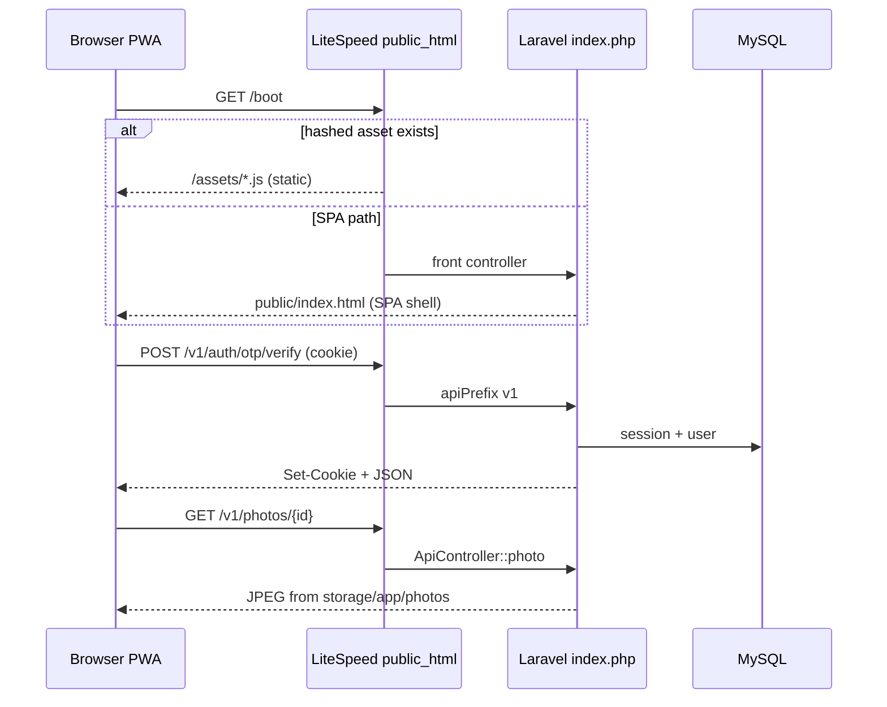
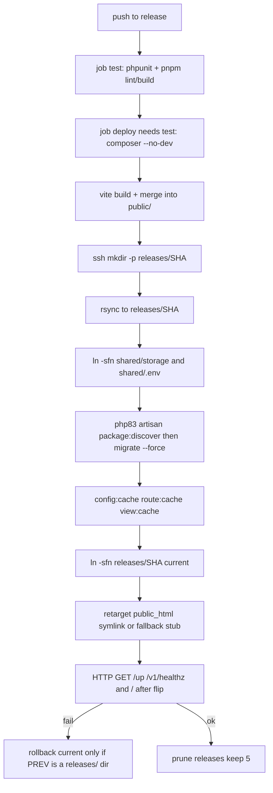

# GameMatch production deploy on Hostinger Business + GitHub Actions (`release` branch)

| Field | Value |
| --- | --- |
| **Title** | GameMatch production deploy on Hostinger Business + GitHub Actions |
| **Author** | TBD |
| **Date** | 2026-08-26 |
| **Status** | Draft |
| **Repo** | [dukedelaet/game-match-pwa](https://github.com/dukedelaet/game-match-pwa) |
| **Audience** | Duke (`dukedelaet`), Sophie (`hocoder-sophie`) |

---

## Overview

GameMatch is a play-first dating PWA: React 19 + Vite + Tailwind 4 in `apps/web`, Laravel 13 (`php ^8.3`) in `apps/api` with all JSON routes under the `v1` prefix (`apps/api/bootstrap/app.php`). Sessions are cookie-based (`EncryptCookies` + `StartSession` prepended on the API stack; CSRF is excepted for `v1/*`). Photo URLs are absolute (`url('/v1/photos/'.$id)` in `ApiController` / `GameEngine`). Locally Vite proxies `/v1` to `http://127.0.0.1:8000` (`apps/web/vite.config.ts`); production cannot do that.

This document specifies production on **Hostinger Web Hosting Business** (sold as **Unlimited** on most 2026 pages; treat the user’s existing “Business” plan as the target). We will **not** use Hostinger’s Git UI as the deploy trigger. Merging or pushing to a dedicated **`release`** branch runs GitHub Actions: `pnpm` builds the SPA, Composer builds `vendor/` in CI, rsync ships a same-origin tree over SSH (port **65002**), then Artisan migrate/cache runs on the host via the **PHP 8.3 CLI binary**. The SPA static files live inside Laravel `public/` so cookies, `/v1`, photos, and the PWA share one HTTPS origin. Cron runs `php artisan schedule:run` every minute (already required: `GameEngine::advance` in `apps/api/routes/console.php`). Queues use the **database** driver drained by the scheduler, not a `queue:work` daemon.

---

## Background & Motivation

### Current state

- **No CI/CD.** There is no `.github/` directory. Deploys, if any, are manual.
- **Split origin in development.** `scripts/dev.sh` and README: Artisan on `:8000`, Vite on `:5173` with `proxy: { '/v1': 'http://127.0.0.1:8000' }`. `apps/web/src/api.ts` calls relative `/v1/...` with `credentials: 'include'`. That only works if the browser origin is the API origin, or a proxy exists.
- **Wrong default public URL.** `apps/api/.env.example` sets `APP_URL=http://localhost:5173`. Laravel `url()` uses the request root when handling HTTP, but CLI, queued jobs, and mis-detected HTTPS will emit `localhost` or `http://` photo URLs.
- **Demo host is not production.** Vite `allowedHosts` includes `limitlessmentoring.cloud`. That box is a VPS-ish demo, not the Hostinger shared account.
- **Restore already assumes Hostinger.** `docs/runbooks/restore.md` documents hPanel daily MySQL dumps and photos at `storage/app/photos` (written by `ApiController::uploadPhoto`, not the `public` disk).
- **Scheduler is not optional.** `apps/api/routes/console.php` advances live game sessions every minute. Without hPanel cron, matches stall.
- **Local defaults are not production-safe.** `.env.example`: `APP_DEBUG=true`, `SESSION_DRIVER=file`, `QUEUE_CONNECTION=sync`, `CACHE_STORE=file`, `MAIL_MAILER=log`, `DB_PORT=3307` (Docker/user-space MariaDB). Laravel config defaults (without env) are `session=database`, `queue=database`, `cache=database`.

### Pain points this design removes

1. Manual SFTP of a monorepo that still has a Vite dev server baked into muscle memory.
2. Cross-origin cookies if someone deploys the SPA and API on different hosts.
3. Photo URLs pointing at `localhost:5173`.
4. Game sessions that never tick because nobody set cron.
5. Accidental deploys from `main` while it is still the integration branch.

---

## Goals & Non-Goals

### Goals

- One HTTPS origin for PWA, session cookies, `/v1/*`, and `/v1/photos/{id}`.
- Push/merge to **`release`** is the only production deploy trigger (`on.push.branches: [release]`). `main` does not deploy.
- Build Node on GitHub Actions; do **not** require Node.js on the shared host.
- Ship PHP dependencies as a CI-built `vendor/` tree (justified below).
- Post-upload Artisan: `package:discover`, `migrate --force`, `config:cache`, `route:cache`, `view:cache`. `storage:link` is **not** a hard failure (photos are not on the public disk); create `public/storage` with `ln -sfn` only after PHP `symlink()` is enabled.
- Cron `* * * * *` → `schedule:run`; queue via database + scheduler.
- Session/cache without Redis (file or database).
- Split work into GitHub issues: human/hPanel → `dukedelaet`; code/CI → `hocoder-sophie`.
- Preserve `storage/app/photos` and `.env` across deploys.
- Document rollback (previous release directory or last good rsync).

### Non-goals

- Hostinger Git integration, Hostinger Node.js websites, Docker on the host, Redis, Supervisor, `php artisan serve`, Vite in production.
- Cloud Startup / VPS / Game Panel (an upgrade is only a future exit, not this rollout).
- SMS/email OTP provider wiring (OTP is cached in `ApiController::otpStart`; real send is later). Shared-host sendmail is 10/min and 100/day — do not depend on it.
- Changing the `v1` prefix or moving off session cookies. (`shouldRenderJsonWhen` still matches `api/*` while the prefix is `v1`; clients send `Accept: application/json`, so this is OK and out of scope.)
- Multi-region, blue/green load balancers, or CDN invalidation beyond Hostinger’s free CDN if already on the plan.
- Picking the public hostname (see Open Questions). Do not hard-code a production domain in app code.

---

## Hostinger Business constraints (verified)

Sources (retrieved 2026-08-26):

- [Parameters and limits of hosting plans](https://www.hostinger.com/support/6976044-parameters-and-limits-of-hosting-plans-in-hostinger/) (updated 2026-08-03)
- [New web and cloud hosting limits / plan versions](https://www.hostinger.com/support/10717644-new-web-and-cloud-hosting-limits-at-hostinger/) (updated 2026-08-10)
- [Rsync at Hostinger](https://www.hostinger.com/support/how-to-use-rsync-to-sync-files-and-directories-at-hostinger/)
- [Composer issues (CLI PHP ≠ website PHP)](https://www.hostinger.com/support/5792082-how-to-solve-common-composer-issues-at-hostinger/)
- [Cannot change website home directory on Web/Cloud](https://www.hostinger.com/support/1583494-what-is-the-path-to-your-website-s-root-home-directory-and-how-to-change-it-in-hostinger/)
- [PHP version in hPanel](https://www.hostinger.com/support/1575755-how-to-change-the-php-version-of-your-hostinger-hosting-plan/)
- [PHP 8.3 CLI path / composer platform mismatch](https://dev.to/joassanon/how-i-fixed-a-php-version-mismatch-on-hostinger-shared-hosting-and-what-actually-made-it-work-575c)
- [Enable disabled PHP functions (incl. `symlink`) on Web/Cloud](https://www.hostinger.com/support/how-to-enable-disabled-php-functions-at-hostinger/) — symlink is **off by default** until removed from `disable_functions`

### Plan naming (2026)

Hostinger now sells the former **Web Business** tier as **Unlimited** on most pages. Existing Business customers keep that SKU. CPU/RAM/PHP-worker numbers below are the **Unlimited / Business / v3 Business** row, not Cloud Startup.

Limits **do** vary by purchase date:

| Version | Purchase window |
| --- | --- |
| v1 | until 2025-04-23 |
| v2 | 2025-04-24 … 2025-12-16 |
| v3 | from 2025-12-17 |

v1 Business had **200 GB** disk; v2/v3 Business / Unlimited have **50 GB**. RAM (3 GB) and CPU (2 cores) are the same across versions. Duke must confirm the version in hPanel → plan Details (Open Questions).

### Resource envelope we design against (Unlimited / Business v3)

| Parameter | Value | Implication for GameMatch |
| --- | --- | --- |
| CPU | 2 cores (burstable, not dedicated) | Minute cron + PHP workers share a CPU-seconds quota; keep `schedule:run` cheap |
| RAM | 3 GB account | No Redis, no Node, no extra PHP-FPM pool |
| Disk | 50 GB (v2/v3) or 200 GB (v1) | Photos + a few release dirs; prune old releases |
| Inodes | 600 000 | Do not leave unbounded `vendor` copies; keep ≤5 releases |
| I/O | ~20 480 KB/s | Avoid `--delete` of huge trees; rsync delta is fine |
| PHP workers | **60** | Concurrent `/v1` + photo streams; file/database session OK |
| PHP memory | 2048 MB | Artisan migrate/cache is fine; composer on host is the risky one |
| PHP max execution | 360 s | `queue:work --stop-when-empty --max-time=50` must finish inside cron |
| MySQL size | **3 GB / database** | Prototype scale; photo **files** are not in MySQL |
| MySQL connections / user | 75 | Laravel default pool is fine |
| MySQL query time | 120 s | No huge reports |
| Sendmail | **10/min, 100/day rolling** | Not for OTP at any real volume |
| SSH | yes (not Single plan); **port 65002** | Deploy transport |
| Root / Docker / extra ports | **no** | No `artisan serve`, no Vite, no Redis, no supervisord |
| Node.js on shared web | Unlimited includes **5 Node.js websites on the same plan** (not a separate SKU) | Still do **not** put GameMatch there: Laravel must run as PHP. Build the PWA in Actions; the Node slot is unused | |
| Document root | **`public_html`**, **not configurable** on Web/Cloud | Laravel `public/` must be what `public_html` serves (symlink or rsync) |
| Git in hPanel | exists | **Out of scope as deploy trigger** |
| SSL | Let’s Encrypt via hPanel | Required for PWA + `SESSION_SECURE_COOKIE` |
| Backups | Daily on Business | Aligns with `docs/runbooks/restore.md` |
| Composer | `composer` / `composer2` on SSH | CLI PHP is the **plan default**, not the per-site selector |
| PHP CLI binaries | `/opt/alt/php83/usr/bin/php` (and php84/php85) | Artisan **must** use php83 |

**Do not invent VPS features.** No `systemctl`, no custom Nginx vhosts, no opening inbound ports, no long-running daemons.

---

## Key Decisions

1. **Branch `release` is the production pin; `main` is integration.**  
   Trigger: `on: push: branches: [release]`. Prevents accidental prod deploys from unfinished `main` work. Promote by merging `main` → `release` (or cherry-pick).

2. **Same origin: SPA files inside Laravel `public/`.**  
   Session cookies (`SESSION_PATH=/`, `SameSite=lax`) and `fetch(..., { credentials: 'include' })` already assume this. Vite proxy is a local-only stand-in.

3. **Document root stays `public_html`; primary is a symlink to `current/public`.**  
   Hostinger will not let us retarget the home directory on Web/Cloud. **Prerequisite:** enable PHP `symlink` (remove it from `disable_functions` in hPanel) so `ln -s` and Laravel `symlink()` work. **Primary:** `public_html → current/public`. **First deploy:** a stock Hostinger `public_html` directory is expected; the remote script `mv`s it aside and creates the symlink (Duke may also `mv` it before the first push). Do **not** fail-closed on the default page. **Fallback (only if the panel recreates `public_html` as a directory we already converted to the stub):** stub `index.php` `require`s `../current/public/index.php` (Laravel `__DIR__` stays `releases/<sha>/public`); rsync static assets excluding that stub. Abort on WordPress or a copied Laravel `index.php`. Never `rsync --delete` a release tree into `public_html`.

4. **Composer in GitHub Actions, not on the host.**  
   Hostinger documents CLI PHP ≠ website PHP, Composer memory exhaustion, and “run Composer locally and upload.” Laravel 13 lockfile needs PHP 8.3. CI `composer install --no-dev --optimize-autoloader --no-scripts` is reproducible and avoids `/opt/alt/php82` surprises. Artisan still runs **on the server** with `/opt/alt/php83/usr/bin/php`.

5. **No Node on the host.**  
   `pnpm --filter web build` in Actions. Hostinger Node.js websites cannot host Laravel.

6. **SSH rsync from Actions (not hPanel Git).**  
   Matches the chosen model; Hostinger’s own rsync docs use `-e "ssh -p 65002"`.

7. **Release directories + `current` symlink; shared `.env` and `storage/`.**  
   Atomic-enough on shared hosting: `mkdir -p releases/<sha>`, rsync into that directory, `ln -sfn` `storage` and `.env`, run Artisan on the new SHA while `current` still points at the old one, then `ln -sfn` `current` and retarget `public_html`. Keep 3–5 releases for rollback. All of this requires the PHP `symlink` function (Decision 3).

8. **Session = database; cache = database; queue = database.**  
   Tables already exist (`sessions`, `cache`, `jobs` in `database/migrations/0001_01_01_00000{0,1,2}_*.php`). Database sessions survive worker spread and are easier to reason about than files if a deploy ever misses linking `storage`. File drivers are acceptable **only** if `storage/` is the shared tree; we still pick database to match Laravel 13 defaults and avoid OTP loss from a bad rsync. **Not Redis.**

9. **Queue drained by scheduler, not a daemon.**  
   `Schedule::command('queue:work --stop-when-empty --max-time=50 --tries=3')->everyMinute();` plus the existing `GameEngine::advance`. No `queue:work` left running.

10. **`APP_URL` is the public HTTPS origin; force HTTPS + trust proxies.**  
    Required for `url('/v1/photos/'.$id)` (`ApiController.php` ~310, ~932; `GameEngine.php` ~353).

11. **SPA fallback is an invokable controller + `Route::fallback`, so `route:cache` works.**  
    Laravel cannot cache routes defined as closures. `apps/api/routes/web.php` must point at a class (e.g. `App\Http\Controllers\SpaController`). `Route::fallback` runs after `/v1/*` and `/up`; do not use a negative-lookahead `/{spa?}` closure. `.htaccess` still serves real files (hashed JS/CSS, `sw.js`) and sends the rest to `index.php`.

12. **Do not deploy `.env` from GitHub.**  
    Secrets live in GitHub for SSH only. Application secrets live in `shared/.env` on the host, created once by Duke.

13. **First production DB gets a catalog seed, not `DatabaseSeeder`.**  
    `database/seeders/DatabaseSeeder.php` is the only source of metros, genders, traits, prompts, `FeatureFlag` rows, the practice house user (`HOUSE_USER_ID`), allowlist hashes, and the Staff admin — but it also turns `auth.public_signup` **on**, enables `staff.force_pair`, and inserts demo phones. Production runs a split **catalog** seeder (`auth.public_signup = false`) plus a one-shot admin artisan. Never `db:seed` the current class on Hostinger.

14. **`deploy.yml` always runs tests before rsync.**  
    A direct push to `release` must not skip PHPUnit/`pnpm build`. Two jobs: `test` then `deploy` (`needs: test`). Pin Node **22** and PHP **8.3**. Protect `release` (no force-push; required CI).

---

## Proposed Design

### High-level architecture

```mermaid
flowchart LR
  Dev[Engineers] -->|PR| Main[main]
  Main -->|merge / cherry-pick| Rel[release]
  Rel -->|push| GHA[GitHub Actions deploy.yml]
  GHA -->|pnpm build + composer --no-dev| Artifact[release tarball / workspace]
  Artifact -->|rsync SSH :65002| Host[Hostinger account]
  Host --> RelDir["~/domains/HOST/releases/SHA"]
  RelDir --> Current["current -> releases/SHA"]
  Current --> Pub["current/public"]
  Pub -.->|symlink| DocRoot["~/domains/HOST/public_html"]
  Browser -->|HTTPS same origin| DocRoot
  DocRoot --> LS[LiteSpeed / public/index.php]
  LS --> Laravel[Laravel 13]
  Laravel --> MySQL[(hPanel MySQL)]
  Laravel --> Photos["shared/storage/app/photos"]
  Cron[hPanel cron every minute] -->|php83 artisan schedule:run| Laravel
```



### Request flow (same origin)



### On-disk layout (Hostinger)

Typical paths (confirm in hPanel FTP accounts):

```
/home/uXXXXXXXX/domains/<PRODUCTION_HOST>/
  public_html -> /home/uXXXXXXXX/domains/<PRODUCTION_HOST>/current/public
  current     -> releases/<git-sha>
  releases/
    <git-sha>/
      artisan, bootstrap/, app/, config/, database/, routes/, vendor/,
      public/          # Laravel index.php + Vite dist (index.html, assets/, sw.js, …)
      .env -> ../../shared/.env
      storage -> ../../shared/storage
  shared/
    .env
    storage/
      app/photos/      # never deleted by rsync
      app/public/
      app/private/
      framework/{cache,sessions,views}/
      logs/
  .well-known/         # only if ACME needs it; prefer leaving SSL to hPanel
```

**Prerequisite (Duke, before any `ln -s`):** hPanel → PHP Configuration → **disable_functions** → enable **`symlink`**. Hostinger disables it by default on Web/Cloud; without it, `current`, `public_html`, shared `storage`/`.env` links, and PHP `symlink()` all fail. Confirm with `ln -sfn /tmp/gm-symlink-test ~/domains/${PRODUCTION_HOST}/.symlink-test && rm ~/domains/${PRODUCTION_HOST}/.symlink-test`.

`public_html` as a **directory** is Hostinger’s default (placeholder page or empty). That is **not** an error on the first deploy.

**Preferred (Duke, issue 7, before the first `release` push):**

```bash
cd ~/domains/${PRODUCTION_HOST}
# Do this BEFORE Actions runs so the first rsync can ln -s into a missing name.
# The hostname 404s until deploy-remote.sh creates public_html -> current/public.
mv public_html public_html.bak
```

**Required (script, every deploy including the first):** `deploy-remote.sh` retargets the docroot itself. It must not assume Duke already moved the default directory, and it must not `exit 1` on a stock Hostinger `public_html`. Heuristic (after `current` points at the new SHA):

| `public_html` is… | Action |
| --- | --- |
| missing, or already a symlink | `ln -sfn "$DOMAIN_PATH/current/public" "$DOMAIN_PATH/public_html"` |
| directory whose `index.php` contains the stub marker `current/public/index.php` | fallback recipe (asset rsync; keep stub) |
| directory that looks like WordPress (`wp-config.php` / `wp-admin`) or a copied Laravel `index.php` (`__DIR__.'/../vendor/autoload.php'` without the stub marker) | **exit 1** (do not clobber an existing app) |
| any other directory (empty, Hostinger default page, `default.html`) | `mv public_html public_html.bak.$TIMESTAMP` then `ln -sfn current/public public_html` |

Never `rsync --delete` a release tree into `public_html`. Later deploys only `ln -sfn releases/<sha> current` (symlink already in place).

### What gets built in CI

From repo root (`package.json` already has `"build": "pnpm --filter web build"`):

1. **SPA:** `pnpm install --frozen-lockfile` then `pnpm --filter web build` (`apps/web/package.json`: `tsc -b && vite build`). Output: `apps/web/dist/` (`index.html`, `assets/`, PWA `sw.js` / workbox, `manifest.webmanifest`, `favicon.svg`).
2. **API vendor:** `composer install --no-dev --optimize-autoloader --no-scripts` in `apps/api` on **PHP 8.3**. `--no-scripts` avoids Artisan during CI (no `.env`, no DB). `package:discover` runs on the server after upload.
3. **Merge SPA into Laravel public** (in the runner, before rsync):

`scripts/sync-spa.sh` is the **only** exclude list (do not copy a second list into `deploy.yml`):

```bash
rsync -a apps/web/dist/ apps/api/public/ \
  --exclude index.php \
  --exclude .htaccess \
  --exclude robots.txt
```

Keep Laravel’s `apps/api/public/index.php`, `.htaccess`, and `robots.txt` (`User-agent: *` / `Disallow:` — allow-all for first beta; PWA and `/legal` stay crawlable). Vite’s `index.html` **must** coexist. Hostinger LiteSpeed `DirectoryIndex` typically lists **`index.php` before `index.html`**, so `/` hits Laravel and `SpaController` returns the shell. A client that requests `/index.html` **bypasses Laravel** (static file) — usually OK. Hashed `/assets/*` are real files → rewrite `!-f` serves them without PHP. Later, add `Disallow: /staff` in Laravel’s `robots.txt` if that path is public.

4. **Rsync the Laravel tree** (not the whole monorepo): `apps/api/` → `releases/<sha>/`. **Exclude list (single source of truth):** `.env`, `storage/`, `tests/`, `phpunit.xml`, `node_modules`, `.git`. CI must `mkdir -p` the remote `releases/<sha>` first.

### Deploy sequence (Actions → SSH)



HTTP probes **cannot** see the new tree until the document root points at it. Ordering is:

1. `mkdir -p releases/$SHA` then rsync the new tree (old `current` still live).
2. Link `shared/.env` and `shared/storage` into the new SHA.
3. `$PHP artisan package:discover --ansi` (CI used `--no-scripts`, so this is mandatory).
4. `$PHP artisan migrate --force` (schema is forward-only; this is the point of no return for DB).
5. `$PHP artisan config:cache && route:cache && view:cache`.
6. **Pre-flip SPA gate:** `test -f "$DOMAIN_PATH/releases/$SHA/public/index.html"` or exit 1 (catches a botched `sync-spa.sh` before touching the live symlink).
7. **Flip** `ln -sfn releases/$SHA current` and retarget `public_html` using the first-deploy heuristic above (stock Hostinger directory is moved aside, not fail-closed).
8. **Then** HTTP-probe `$PRODUCTION_URL/up`, `$PRODUCTION_URL/v1/healthz`, and `$PRODUCTION_URL/` (body must look like the SPA shell — e.g. contains `id="root"` or `<title>GameMatch` — not Hostinger’s default page). On failure, rollback `current` **only if** `PREV` is a directory under `releases/`; on first deploy `PREV` is empty and the script leaves `current` pointing at `$SHA` and exits 1 (schema stays new).
9. Best-effort: `ln -sfn ../../shared/storage/app/public public/storage` if `symlink()` works. **Do not** fail the deploy on `artisan storage:link` — GameMatch photos are `storage/app/photos` served by `ApiController::photo`, not the public disk.

Remote Artisan **must** use `$PHP` (`HOSTINGER_PHP_BIN`, typically `/opt/alt/php83/usr/bin/php`). Skip `event:cache` unless we add events; skip `optimize` as a blob so a single command’s failure is obvious.

**Health payloads:** `/up` stays Laravel’s framework probe (process up). `/v1/healthz` is upgraded from `{ok:true}` to also `SELECT 1` against MySQL (and optionally `is_writable(storage_path('logs'))`). Still unauthenticated; do not leak DSN, versions, or paths. PHPUnit must assert JSON `ok: true` and a 503 if DB is down. `GET /` after flip proves `public/index.html` was merged — `/up` and `/v1/healthz` alone would go green with a missing SPA shell.

OPcache on Unlimited: max accelerated files **16299**, max file size **256 KB**. After a symlink flip, LiteSpeed/OPcache may keep a stale `index.php` until revalidate. Runbook: `curl -fsS $PRODUCTION_URL/up` immediately after flip; if 500, wait a few seconds or touch `current/public/index.php`. Not fatal at demo scale.

### SPA fallback (must not swallow `/v1`; must be `route:cache`-safe)

Today `apps/api/routes/web.php` serves `view('welcome')` at `/` — the default Laravel splash, not GameMatch.

**Do not register a closure.** `php artisan route:cache` exits non-zero if any route is a closure, and the remote script treats that as a failed deploy.

```php
// apps/api/app/Http/Controllers/SpaController.php
namespace App\Http\Controllers;

class SpaController extends Controller
{
    public function __invoke()
    {
        $index = public_path('index.html');
        abort_unless(is_file($index), 500, 'SPA index.html missing');

        return response()->file($index);
    }
}

// apps/api/routes/web.php
use App\Http\Controllers\SpaController;
use Illuminate\Support\Facades\Route;

Route::fallback(SpaController::class);
```

Why this is safe:

- API routes are registered with `apiPrefix: 'v1'` **before** fallback. `/v1/*` never hits `SpaController`.
- `/up` is registered by `withRouting(health: '/up')` and also wins over fallback.
- `public/.htaccess` already: if the request is an existing file, do not rewrite. Workbox `sw.js`, `assets/*`, `favicon.svg` stay static.
- PWA `navigateFallback: '/offline'` (`vite.config.ts`) is a client route; `/offline` hits fallback HTML, which is correct.
- `start_url: '/boot'` likewise.
- `Route::fallback(SpaController::class)` is a **controller reference**, so `route:cache` works. An inline `function () { ... }` would not.

Do **not** add a rewrite of everything to `index.html` in `.htaccess`; that would skip Laravel and kill `/v1`.

### Fallback document-root recipe (only if `public_html` cannot be a symlink)

Stock `apps/api/public/index.php` uses `__DIR__.'/../vendor/autoload.php'` and `__DIR__.'/../bootstrap/app.php'`. `__DIR__` is the file that was **parsed**, not the stub that `require`d it. If `public_html` is a **copy** of `public/` sitting next to `releases/`, `__DIR__/..` is `domains/<host>/`, which has no `vendor/` — white screen.

**Complete fallback:**

```
~/domains/<PRODUCTION_HOST>/
  current -> releases/<sha>
  public_html/                 # real directory, Hostinger docroot
    index.php                  # STUB only (below)
    .htaccess                  # copy of Laravel public/.htaccess
    assets/                    # rsynced from current/public/assets
    favicon.svg, sw.js, …      # other static files from current/public
  releases/<sha>/public/index.php   # real Laravel front controller
```

Stub `public_html/index.php` (committed as `scripts/hostinger-public-html-index.php`):

```php
<?php
require __DIR__.'/../current/public/index.php';
```

Inside Laravel’s `public/index.php`, `__DIR__` is still `.../current/public` (realpath of the required file), so `vendor/` and `bootstrap/` resolve. `public_path()` remains `current/public`.

Deploy script when `public_html` is a directory **and already the stub** (later deploys after a panel recreate we chose not to fight):

1. Assert `public_html/index.php` contains `current/public/index.php`.
2. `rsync -a --delete --exclude index.php current/public/ public_html/` so `/assets/*` exist as files (LiteSpeed will not serve files outside the docroot).
3. Never `rsync --delete` `releases/` *into* `public_html`.

A **stock Hostinger** directory is **not** this path — it is moved aside and replaced with the primary symlink (see first-deploy heuristic). Prefer the symlink; the stub fallback is a two-copy asset rsync and a brief inconsistency window.

### Session cookies on one origin

`bootstrap/app.php` already:

- prepends `EncryptCookies`, `AddQueuedCookiesToResponse`, `StartSession` on the **api** group
- `validateCsrfTokens(except: ['v1/*'])`

Production `.env`:

```
SESSION_DRIVER=database
SESSION_SECURE_COOKIE=true
SESSION_SAME_SITE=lax
SESSION_DOMAIN=          # leave null; host-only cookie on the chosen origin
SESSION_PATH=/
```

No CORS package needed. Do not set `SESSION_DOMAIN=.limitlessmentoring.cloud` unless we deliberately share cookies across subdomains (we should not).

### HTTPS / `url()` / photos

`url('/v1/photos/'.$id)` appears in:

- `apps/api/app/Http/Controllers/ApiController.php` (`uploadPhoto`, `publicMe`)
- `apps/api/app/Support/GameEngine.php` (`photoUrl`)

Files themselves live at `storage/app/photos/{userId}/{uuid}.jpg` (GD jpeg, max 1080px, upload `max:10240` KiB). They are **not** on the `public` disk; `storage:link` does not expose them. Serving is `response()->file()` after auth/block checks.

Required app boot (production only):

```php
// AppServiceProvider::boot
if ($this->app->environment('production')) {
    \Illuminate\Support\Facades\URL::forceScheme('https');
}
```

And in `bootstrap/app.php` (need `use Illuminate\Http\Request`):

```php
$middleware->trustProxies(
    at: '*',
    headers: Request::HEADER_X_FORWARDED_PROTO | Request::HEADER_X_FORWARDED_HOST
);
```

Hostinger terminates TLS in front of LiteSpeed; without trusted proxies, `url()` can emit `http://`. We **do not** trust `X-Forwarded-For`: `at: '*'` plus that header lets any client spoof `sessions.ip_address`. Proto/host are enough for `URL::forceScheme` / `url('/v1/photos/...')`. `Request::ip()` then stays the LiteSpeed hop (typical for this plan). Document in `deploy.md`: if Hostinger’s hop IPs are ever published, we can lock `at:` to those instead of `*`.

`APP_URL=https://<PRODUCTION_HOST>` with **no trailing path**. Never `http://localhost:5173` in production.

### Queue + schedule

`apps/api/routes/console.php` today:

```php
Schedule::call(function () {
    GameSession::query()
        ->whereNotIn('state', ['completed', 'forfeit', 'cancelled'])
        ->each(fn ($s) => GameEngine::advance($s->fresh(['rounds.answers', 'participants'])));
})->everyMinute();
```

`GameEngine::heartbeat()` (`GameEngine.php`) only runs when a client hits `sessionShow` / `sessionAnswer` (`ApiController`). The 15s stale-forfeit inside `advance()` **will not fire** if both clients background the PWA. Cron is mandatory; client heartbeat does not replace it. `onOneServer()` is irrelevant (one account, one scheduler).

Change the advance event to overlap-safe, and add queue draining as **speculative** (no `ShouldQueue` jobs exist yet — an empty `jobs` table every minute is expected, not an incident):

```php
Schedule::call(function () {
    GameSession::query()
        ->whereNotIn('state', ['completed', 'forfeit', 'cancelled'])
        ->each(fn ($s) => GameEngine::advance($s->fresh(['rounds.answers', 'participants'])));
    @touch(storage_path('framework/schedule-heartbeat'));
})->everyMinute()->name('gamematch-advance')->withoutOverlapping(4);

Schedule::command('queue:work --stop-when-empty --max-time=50 --tries=3')
    ->everyMinute()
    ->withoutOverlapping(5);
```

Without `withoutOverlapping` on advance, a second `schedule:run` can start while the first is still walking rows (PHP max execution 360s; 2 burstable cores). Queue drain stays so later mail/OTP jobs do not need a daemon; on-call should not debug empty `jobs` until we ship a job.

hPanel cron (Duke):

```
* * * * * /opt/alt/php83/usr/bin/php /home/uXXXXXXXX/domains/<PRODUCTION_HOST>/current/artisan schedule:run >> /home/uXXXXXXXX/domains/<PRODUCTION_HOST>/shared/storage/logs/cron.log 2>&1
```

Use the `current` path so cron does not need updating per release. Confirm the PHP 8.3 binary exists on the account (`ls /opt/alt/php83/usr/bin/php`).

### Cache / OTP

`otpStart` stores codes in `Cache::put('otp:'.$phone, $code, 15 minutes)`. With `CACHE_STORE=database`, OTPs survive deploys. `APP_DEBUG=false` **must** be production: debug mode returns `devCode` in the JSON (`ApiController::otpStart`). Production OTP currently has **no SMS/email sender** — codes exist only in cache.

**Closed-beta procedure (Duke must finish before first-login smoke):**

1. `auth.public_signup` is **false** (catalog seeder). Tester phones are hashed into `allowlist_phones`.
2. Tester calls `POST /v1/auth/otp/start` with that E.164 phone.
3. Duke SSHs and runs:

```bash
$PHP artisan gamematch:otp +15551111111
```

The command reads `Cache::get('otp:'.$phone)` (database cache row) and prints the code to the terminal only. Do **not** turn on `APP_DEBUG`. Do **not** query the `cache` table by hand unless the artisan is broken (key is Laravel’s prefixed `gamematch-cache-otp:+1555…` plus serialization).

4. Tester `POST /v1/auth/otp/verify` with that code; session cookie is `Secure`.

Until this artisan exists, smoke **login** is blocked (issue 15 blocked-by 9). Deploy plumbing (healthz, SPA shell) can still land.

### PHP extensions (hPanel PHP Configuration)

Laravel 13 + this app:

- Required: `pdo_mysql`, `mbstring`, `openssl`, `tokenizer`, `xml`, `ctype`, `json`, `fileinfo`, `bcmath` or `gmp` (framework), `curl`
- **Required for photos:** `gd` (`imagecreatefromstring` / `imagejpeg` in `uploadPhoto`)
- Enable **OPcache** (pre-installed; enable per site)
- **Enable PHP function `symlink`:** remove it from hPanel `disable_functions` (Hostinger default-disables it on Web/Cloud). Required for `ln -s` of `current` / `public_html` / shared `storage` and for any `symlink()` call.
- Do **not** need: Redis, imagick (GD is what the code uses)

Website PHP selector: **8.3** (8.4/8.5 likely work but we pin 8.3 to `composer.json`). CLI artisan: same 8.3 binary.

### `.htaccess`

Keep stock Laravel `apps/api/public/.htaccess` (Authorization + X-XSRF-Token passthrough, trailing-slash redirect, front controller). Optional first lines if a subdomain must force PHP 8.3:

```apache
<FilesMatch ".(php|phtml)$">
  SetHandler application/x-lsphp83
</FilesMatch>
```

([Hostinger PHP-per-folder table](https://www.hostinger.com/support/4047803-how-to-change-the-php-version-for-subfolders-or-subdomains-in-hostinger/) includes `application/x-lsphp83`.)

Deny web access to anything above `public/` by never putting `.env` or `vendor/` inside `public_html`.

### PWA notes

- `vite-plugin-pwa` `registerType: 'autoUpdate'`, `start_url: '/boot'`, `display: standalone`.
- Installability requires HTTPS (hPanel SSL).
- After deploy, clients may keep an old service worker until the new `sw.js` activates. Acceptable for v1; document a hard refresh in the runbook.
- Google Fonts in `apps/web/index.html` are loaded from `fonts.googleapis.com` — fine, but CSP is not in scope.

### Load / latency / storage (order-of-magnitude)

| Item | Estimate |
| --- | --- |
| Concurrent PHP workers | 60 cap; demo traffic << 10 |
| `/v1/healthz` | in-process JSON, target **< 200 ms** TTFB |
| Authenticated `/v1/home` | a few queries; target **< 500 ms** p95 at demo scale |
| Photo GET | `response()->file` of ~100–300 KB JPEG |
| Photo POST | GD resize, 10 MB upload cap; Hostinger upload limit is 2048 MB (not the bottleneck) |
| DB | well under 3 GB for thousands of users + messages |
| Disk | 5 releases × (vendor ~80–120 MB + SPA ~1 MB) + photos; prune releases |
| Cron | `GameEngine::advance` over **active** sessions only; keep that set small |

If cron + traffic trips 503s, the exit is Cloud/VPS — not more PHP workers on this plan.

---

## API / Interface Changes

No public JSON contract changes. Client already uses relative `/v1` (`apps/web/src/api.ts`).

| Surface | Before | After |
| --- | --- | --- |
| `apps/api/routes/web.php` | Laravel `welcome` at `/` | `Route::fallback(SpaController::class)` (invokable, cacheable) |
| `SpaController` | none | returns `public/index.html` |
| `ApiController::health` | `{ok: true}` only | also `SELECT 1`; 503 if DB down; no internals |
| `apps/web/vite.config.ts` | `proxy /v1` (dev only) | unchanged for `pnpm dev`; production has no Vite server |
| `AppServiceProvider` | empty `boot` | production `URL::forceScheme('https')` |
| `bootstrap/app.php` | no `trustProxies` | trust `*` for **proto + host only** (not `X-Forwarded-For`) |
| `routes/console.php` | `GameEngine::advance` every minute, no overlap lock | + `withoutOverlapping` on advance; + speculative `queue:work --stop-when-empty` |
| `database/seeders/` | single `DatabaseSeeder` (demo users + `public_signup=true`) | `CatalogSeeder` for prod; `DatabaseSeeder` calls catalog + demo (local only) |
| New artisan | none | `gamematch:otp {phone}` (prints cache OTP); `gamematch:make-admin {phone}` |
| `apps/api/.env.example` | local Docker/MariaDB `:3307`, debug on | comments for production Hostinger values; keep local defaults for `scripts/dev.sh` |
| New | none | `.github/workflows/ci.yml`, `deploy.yml`; `scripts/deploy-remote.sh`; `scripts/sync-spa.sh`; `scripts/hostinger-public-html-index.php` |

`GET /up` and `GET /v1/healthz` become the production probes. Do not auth-protect them.

---

## Data Model Changes

**No schema changes.** Existing migrations already create `sessions`, `cache`, `cache_locks`, `jobs`, `job_batches`, `failed_jobs`, GameMatch tables (`2026_08_26_100000_create_gamematch_tables.php`).

### Seeders (this *is* a code change)

`DatabaseSeeder` today is the **only** source of:

- metros, genders, traits, prompts
- `FeatureFlag` rows (`auth.public_signup` = **true**, `games.enabled`, `staff.force_pair` = **true**)
- house user `config('gamematch.house_user_id')` (practice mode)
- allowlist hashes for `+15551111111` / `+15552222222` / `+15550000000`
- demo users Alex/Jordan and Staff `role=admin`

Running it on Hostinger would open public signup and ship demo phones. Running **nothing** leaves catalogs empty, practice mode unable to resolve the house user, and no admin for `POST /v1/staff/allowlist`.

Split:

| Class | What | Where it runs |
| --- | --- | --- |
| `CatalogSeeder` | metros, genders, traits, prompts, house user, flags with **`auth.public_signup = false`**, `staff.force_pair = false`, `games.enabled = true`. **Idempotent:** `updateOrCreate` on metro `slug`, gender `slug`, trait `slug`, prompt identity (e.g. `game_kind` + payload hash or a stable `slug` column if we add one), `FeatureFlag` `key`, house user `id` = `config('gamematch.house_user_id')`. A second `db:seed --class=CatalogSeeder --force` must not throw on unique slugs. | production **once**, and again after a catalog wipe (restore); local via `DatabaseSeeder` |
| `DemoUserSeeder` | Alex/Jordan/Staff + allowlist of demo phones | **local / tests only** |
| `DatabaseSeeder` | `$this->call([CatalogSeeder::class, DemoUserSeeder::class])` | `migrate:fresh --seed` locally |

First production data (Duke, after migrate, SSH, **not** in `deploy.yml` every push):

```bash
$PHP artisan db:seed --class=CatalogSeeder --force
$PHP artisan gamematch:make-admin +15550000000   # creates/updates allowlist + role=admin
```

`gamematch:make-admin` is the first-admin path: hash the phone, insert `allowlist_phones`, upsert a user with `role=admin`. No `APP_DEBUG`. Do not put demo Alex/Jordan on the public origin.

### Migration strategy

- Production: `php artisan migrate --force` on each deploy.
- Never `migrate:fresh` / `migrate:refresh` / `DatabaseSeeder` on the Hostinger database.
- Photos are files; they are not migrated. `shared/storage` must exist before the first upload.

### Production `.env` (created once on the host, never committed)

```
APP_NAME=GameMatch
APP_ENV=production
APP_KEY=base64:...          # php artisan key:generate --show, once
APP_DEBUG=false
APP_URL=https://<PRODUCTION_HOST>

LOG_CHANNEL=daily
LOG_LEVEL=info

DB_CONNECTION=mysql
DB_HOST=127.0.0.1           # hPanel “MySQL hostname”; often localhost
DB_PORT=3306                # not 3307
DB_DATABASE=...             # hPanel name (often prefixed uXXXX_)
DB_USERNAME=...
DB_PASSWORD=...

SESSION_DRIVER=database
SESSION_LIFETIME=120
SESSION_SECURE_COOKIE=true
SESSION_SAME_SITE=lax

QUEUE_CONNECTION=database
CACHE_STORE=database
FILESYSTEM_DISK=local

MAIL_MAILER=log             # until a real SMTP provider exists
```

`DB_HOST`: Hostinger remote MySQL is typically **off**. Use `localhost` / `127.0.0.1` on the same account. Confirm in hPanel → Databases.

---

## GitHub Actions

### Workflows

| File | Trigger | Purpose |
| --- | --- | --- |
| `.github/workflows/ci.yml` | `pull_request` (to `main` **and** `release`) + `push` to `main` | lint, `pnpm --filter web build`, PHPUnit |
| `.github/workflows/deploy.yml` | `push` to **`release` only** | **job `test`** (same as CI) then **job `deploy`** (`needs: test`) |

A direct push or admin merge to `release` without a PR must **not** skip tests. `deploy.yml` is two jobs; rsync is unreachable if `test` fails.

Pin:

- **Node 22** (`actions/setup-node@v4` with `node-version: '22'` and `cache: pnpm`; enable Corepack or `npm i -g pnpm`).
- **PHP 8.3** (`shivammathur/setup-php` with extensions `gd, pdo_mysql, mbstring, tokenizer, xml, ctype, curl, fileinfo, zip`).

PHPUnit: `apps/api/phpunit.xml` still points at local `:3307` / user `gamematch` for laptops (no `force` attribute). PHPUnit 12 only writes xml env when the name is unset in the process (`if ($force || getenv($name) === false)`). GitHub job `env:` therefore already wins; **do not** edit `phpunit.xml` `force` flags. Keep the MySQL service + `DB_PORT=3306` overrides. Service:

```yaml
services:
  mysql:
    image: mysql:8.0
    env:
      MYSQL_DATABASE: gamematch_test
      MYSQL_ROOT_PASSWORD: root
    ports:
      - 3306:3306
    options: >-
      --health-cmd="mysqladmin ping -h 127.0.0.1 -uroot -proot"
      --health-interval=5s --health-timeout=5s --health-retries=15
env:
  DB_CONNECTION: mysql
  DB_HOST: 127.0.0.1
  DB_PORT: 3306
  DB_DATABASE: gamematch_test
  DB_USERNAME: root
  DB_PASSWORD: root
  DB_URL: ''
```

Do not require port 3307 in Actions. Do not use `appleboy/scp-action` — it is not delta rsync and does not match `releases/<sha>/`.

**Branch protection (Duke on GitHub, issue 8):** `release` — no force-push, no deletions, required check `test` from `deploy.yml` (or `ci.yml` if we wait for that workflow on the same SHA). `main` — required `ci.yml`. GitHub Environments (`production` with required reviewers) are optional later, not required for v1.

`deploy.yml` outline:

```yaml
name: Deploy production
on:
  push:
    branches: [release]
concurrency:
  group: production-hostinger
  cancel-in-progress: false
jobs:
  test:
    runs-on: ubuntu-latest
    # same steps as ci.yml (phpunit + pnpm lint/build)
  deploy:
    needs: test
    runs-on: ubuntu-latest
    permissions:
      contents: read
    steps:
      # checkout, setup-node 22 + corepack pnpm, setup-php 8.3 + gd
      # pnpm install --frozen-lockfile && pnpm --filter web build
      # composer install --no-dev --optimize-autoloader --no-scripts (working-directory: apps/api)
      # scripts/sync-spa.sh
      # ssh-agent + UserKnownHostsFile from HOSTINGER_SSH_KNOWN_HOSTS
      # ssh mkdir -p "$DOMAIN_PATH/releases/$GITHUB_SHA"
      # rsync (flags below)
      # ssh env DOMAIN_PATH SHA PHP_BIN PRODUCTION_URL bash -s < scripts/deploy-remote.sh
      # (PREV is computed inside the remote script; CI does not pass it)
```

### GitHub secrets and variables (exact names)

Store on the **repo** (or org) as **Actions secrets** unless marked `VAR` (Actions variables).

| Name | Type | Set by | Purpose |
| --- | --- | --- | --- |
| `HOSTINGER_SSH_HOST` | secret | dukedelaet | Server hostname or IP from hPanel → SSH Access |
| `HOSTINGER_SSH_PORT` | **var** | dukedelaet | Default `65002` |
| `HOSTINGER_SSH_USER` | secret | dukedelaet | e.g. `u123456789` |
| `HOSTINGER_SSH_KEY` | secret | dukedelaet | Private key; public half in hPanel SSH keys. Comment: `github-actions-gamematch-deploy` |
| `HOSTINGER_SSH_KNOWN_HOSTS` | secret | dukedelaet | Output of `ssh-keyscan -p 65002 $HOST` |
| `HOSTINGER_DOMAIN_PATH` | **var** | dukedelaet | Absolute `/home/u…/domains/<PRODUCTION_HOST>` (no trailing slash) |
| `HOSTINGER_PHP_BIN` | **var** | dukedelaet | `/opt/alt/php83/usr/bin/php` after Duke confirms |
| `PRODUCTION_URL` | **var** | dukedelaet | `https://<PRODUCTION_HOST>` for the health curl (no trailing slash) |

**Not stored in GitHub:** `APP_KEY`, DB password, mail credentials. Those stay in `shared/.env` on disk.

SSH key: **ed25519 deploy key dedicated to Actions**. Do not reuse Duke’s interactive SSH key. Restrict the public key in hPanel if the UI allows.

**Transport: rsync over `ssh-agent` only.** Freeze this; no scp-action.

### Remote script (`scripts/deploy-remote.sh`)

The script **does not** inherit GitHub env by magic. Invoke with an explicit env block:

```bash
ssh -p "$HOSTINGER_SSH_PORT" \
  -o UserKnownHostsFile="$KNOWN_HOSTS_FILE" \
  -o IdentitiesOnly=yes \
  "$HOSTINGER_SSH_USER@$HOSTINGER_SSH_HOST" \
  "env DOMAIN_PATH=$(printf %q "$HOSTINGER_DOMAIN_PATH") \
      SHA=$(printf %q "$GITHUB_SHA") \
      PHP_BIN=$(printf %q "$HOSTINGER_PHP_BIN") \
      PRODUCTION_URL=$(printf %q "$PRODUCTION_URL") \
      bash -s" < scripts/deploy-remote.sh
```

`scripts/deploy-remote.sh` starts with `set -euo pipefail` and requires `DOMAIN_PATH`, `SHA`, `PHP_BIN`, `PRODUCTION_URL`. It does **not** require `PREV` from CI.

1. `test -f "$DOMAIN_PATH/shared/.env"` or exit.
2. `ln -sfn "$DOMAIN_PATH/shared/.env" "$DOMAIN_PATH/releases/$SHA/.env"`
3. `ln -sfn "$DOMAIN_PATH/shared/storage" "$DOMAIN_PATH/releases/$SHA/storage"`
4. `cd "$DOMAIN_PATH/releases/$SHA"`
5. `"$PHP_BIN" artisan package:discover --ansi`
6. `"$PHP_BIN" artisan migrate --force`
7. `"$PHP_BIN" artisan config:cache && "$PHP_BIN" artisan route:cache && "$PHP_BIN" artisan view:cache`
8. `test -f "$DOMAIN_PATH/releases/$SHA/public/index.html"` or exit 1.
9. `PREV="$(readlink "$DOMAIN_PATH/current" 2>/dev/null || true)"` then `ln -sfn "$DOMAIN_PATH/releases/$SHA" "$DOMAIN_PATH/current"`.
10. Retarget `public_html` with the first-deploy heuristic (missing/symlink → `ln -sfn current/public`; stock Hostinger directory → `mv` aside then symlink; stub directory → asset rsync; WordPress/copied Laravel → exit 1).
11. Best-effort `ln -sfn "$DOMAIN_PATH/shared/storage/app/public" "$DOMAIN_PATH/current/public/storage"` (ignore failure).
12. `curl -fsS "$PRODUCTION_URL/up"`, `curl -fsS "$PRODUCTION_URL/v1/healthz"`, and `curl -fsS "$PRODUCTION_URL/"` (SPA HTML, not Hostinger default). On failure: if `PREV` is a directory under `"$DOMAIN_PATH/releases/"`, `ln -sfn "$PREV" "$DOMAIN_PATH/current"` (and retarget `public_html` if it is a symlink); if `PREV` is empty (first deploy), leave `current` at `$SHA` and exit 1. Never `ln -sfn` an empty path.
13. Prune `releases/` keeping 5 newest directories.

Rsync flags (from CI) — **same exclude list as the design, including `phpunit.xml`:**

```bash
ssh "$HOSTINGER_SSH_USER@$HOSTINGER_SSH_HOST" "mkdir -p ${DOMAIN_PATH}/releases/${GITHUB_SHA}"
rsync -az --delete \
  --exclude '.env' \
  --exclude 'storage/' \
  --exclude 'tests/' \
  --exclude 'phpunit.xml' \
  --exclude 'node_modules/' \
  --exclude '.git/' \
  -e "ssh -p ${HOSTINGER_SSH_PORT} -o UserKnownHostsFile=${KNOWN} -o IdentitiesOnly=yes" \
  apps/api/ "${HOSTINGER_SSH_USER}@${HOSTINGER_SSH_HOST}:${HOSTINGER_DOMAIN_PATH}/releases/${GITHUB_SHA}/"
```

`--delete` applies **inside the new release directory only**, never against `shared/storage` or `public_html`.

### Rollback

```bash
cd "$DOMAIN_PATH"
ls releases/
ln -sfn releases/<PREVIOUS_SHA> current
# if public_html is a symlink it already points at current/public
# if fallback directory: re-run rsync of current/public → public_html excluding stub index.php
```

Forward-only migrations: if the new release migrated, rolling back code may require the new schema to be backward compatible. **Rule:** additive migrations only for production until we have a documented down path.

---

## Alternatives Considered

### 1. Hostinger hPanel Git auto-deploy

**Pros:** One click in Advanced → Git; no Actions SSH key.  
**Cons:** Deploys raw git tree (no `pnpm build`, no `composer --no-dev`); document root is still `public_html`; cannot run Artisan hooks reliably; user explicitly forbade it as the trigger.  
**Decision:** Rejected as trigger. May exist in the panel unused.

### 2. Composer + build on the Hostinger SSH account

**Pros:** Smaller GitHub artifact; “classic” Laravel shared-hosting.  
**Cons:** Hostinger CLI PHP is the **plan** default, often 8.2 while the site is 8.3; Composer memory exhaustion is a documented failure mode; no Node for Vite; slower and less reproducible. Hostinger’s own docs recommend uploading a locally built vendor tree when memory fails.  
**Decision:** Composer in Actions. Artisan stays on the host (needs DB).

### 3. Two origins (SPA on Hostinger Node / Pages, API on PHP)

**Pros:** Cleaner split of static vs PHP.  
**Cons:** Cookie `SameSite` / `Secure` / CORS; `credentials: 'include'` breaks unless we rewrite `api.ts` to an absolute API host and set `SESSION_DOMAIN` + CORS. Photo `url()` would not match the PWA origin. User chose same origin.  
**Decision:** Rejected.

### 4. Upgrade to Cloud Startup or VPS now

**Pros:** Changeable document root (VPS), daemons, Redis, Node, dedicated CPU. Cloud Startup: 4 CPU / 4 GB / 100 PHP workers (Hostinger table).  
**Cons:** Out of scope; cost; this app’s demo load does not require it. Revisit if cron+PHP 503s or we need real SMS workers.  
**Decision:** Not this project. Document as the scale exit.

### 5. rsync `--delete` directly into `public_html` with Laravel sitting in `public_html/` (app source web-visible)

**Pros:** Simple.  
**Cons:** `vendor/`, `.env`, `storage/` must never be web-reachable. One missed `.htaccess` and the app leaks. Hostinger cannot point the vhost at `public/`.  
**Decision:** Rejected. App lives **beside** `public_html`; only `public/` is exposed.

### 6. Laravel Deployer / Envoyer-style tools

**Pros:** Battle-tested release directories, shared `.env`, atomic `current`. Envoyer is the SaaS version of this layout.  
**Cons:** Deployer is more PHP/SSH surface on a host we do not control (no root, flaky CLI PHP, `symlink()` gated). Envoyer is another vendor and still cannot change Hostinger’s document root. A ~40-line `deploy-remote.sh` plus rsync is the right complexity for one shared account.  
**Decision:** Rejected for v1. Revisit if we leave shared hosting.

GitHub Environments with required reviewers on `release` would add a human gate before rsync. Useful later; v1 relies on “only merge to `release` when you mean it” plus `needs: test`.

---

## Security & Privacy Considerations

| Threat | Severity | Mitigation |
| --- | --- | --- |
| `.env` / `vendor` web-readable | **High** | Document root is only `current/public`. Deploy fails if `public_html` is a real dir containing `../.env` patterns. Never rsync `.env` from CI |
| `APP_DEBUG=true` leaks OTP `devCode` and stack traces | **High** | Production `.env` `APP_DEBUG=false`; smoke test that `/v1/auth/otp/start` has no `devCode` |
| Photo IDs in URLs | Medium | `photo()` is session-authenticated and hides blocked users; still UUID, not guess-proof forever. HTTPS only |
| Deploy key theft | **High** | Dedicated Actions key; repo secret; rotate on leak; key cannot sudo (no root anyway) |
| CSRF except `v1/*` | Medium | Same-origin cookies + no CORS; SameSite=lax. Acceptable for this prototype; do not add random extra origins |
| Session fixation / HTTP cookies | Medium | `SESSION_SECURE_COOKIE=true`, force HTTPS, trust **proto/host** only |
| Spoofed `X-Forwarded-For` into `sessions.ip_address` | Medium | Do not include `HEADER_X_FORWARDED_FOR` in `trustProxies` |
| PHP `symlink` still in `disable_functions` | **High** | Duke issue 3; first `ln -s` test before any deploy |
| Shared-host neighbors | Medium | Standard Hostinger isolation; treat as untrusted disk beyond our home dir |
| GitHub workflow injection | Medium | `concurrency` group; do not interpolate untrusted PR titles into SSH; **deploy only from `release`**, not `pull_request` |
| `storage:link` exposing private files | Low | Photos are **not** on the public disk; link only `storage/app/public` |
| OTP brute force | Medium | Existing allowlist + `auth.public_signup` flag; not changed here |
| Sendmail abuse | Low | Keep `MAIL_MAILER=log` until SMTP |
| Backup restore of photos | Medium | Runbook already: restore `storage/app/photos` from file backup, not only SQL |

`APP_KEY` generated once; rotating it invalidates all cookies and encrypted payloads.

Staff routes (`/v1/staff/allowlist`, `/v1/internal/*`) already exist — confirm they stay auth + role gated before public DNS (code review, not this design’s feature work).

---

## Observability

| Signal | Where |
| --- | --- |
| App log | `shared/storage/logs/laravel-YYYY-MM-DD.log` (`LOG_CHANNEL=daily`) |
| Cron log | `shared/storage/logs/cron.log` |
| PHP errors | hPanel → PHP error log / LiteSpeed logs |
| Deploy | GitHub Actions log; remote script `set -euo pipefail` |
| Uptime | `GET /up` (process) and `GET /v1/healthz` (`ok` + DB `SELECT 1`) |
| Cron freshness | `shared/storage/logs/cron.log` and a `storage/framework/schedule-heartbeat` touch from the advance task (smoke checks mtime < 3 min) |
| Failed jobs | `failed_jobs` table when queue is used |
| Disk / inodes / CPU | hPanel plan Details — watch 503s |

**Metrics (lightweight, no extra daemons):** log a line at the end of `schedule:run` (Laravel already logs command failures). Optional later: a GitHub scheduled workflow that curls `/v1/healthz` (needs no extra host process).

**Alerts:** GitHub Actions email/Slack on failed `deploy.yml`. No on-host PagerDuty.

**Do not** use `LOG_LEVEL=debug` in production (OTP codes, PII in request logs).

Production uses `LOG_CHANNEL=daily` (files `shared/storage/logs/laravel-YYYY-MM-DD.log`). Local `.env.example` stays `stack`/`single`. `docs/runbooks/deploy.md` must show:

```bash
tail -f ~/domains/<PRODUCTION_HOST>/shared/storage/logs/laravel-$(date -u +%F).log
tail -f ~/domains/<PRODUCTION_HOST>/shared/storage/logs/cron.log
```

---

## Rollout Plan

### Feature flags

No new product flag. Deploy is gated by the `release` branch. Existing `Flags::on('auth.public_signup')` should stay **off** on first public DNS if allowlist-only is desired.

### Stages

1. **hPanel bootstrap** (Duke): SSH, PHP 8.3 + gd, MySQL, SSL, `shared/.env`, empty `releases/`, cron (can start after first successful upload).
2. **Code on `main`** (Sophie): SPA fallback, trust proxies, workflows, scripts — PRs below. CI green.
3. **Secrets** (Duke): GitHub secrets/vars listed above.
4. **First deploy:** merge to `release`. Watch Actions. Confirm `public_html` symlink. Curl `/up`, `/v1/healthz`, `/` (SPA), `/boot`.
5. **Auth smoke:** OTP start/verify **without** `devCode`; session cookie `Secure`. Upload one photo; URL host equals `APP_URL` host.
6. **Cron smoke:** create an in-progress session (or inspect log) that `GameEngine::advance` runs.
7. **Announce hostname** only after 4–6 pass.

### Rollback

- **Code:** `ln -sfn releases/<prev> current` (seconds).
- **Workflow:** revert the merge commit on `release` and push (redeploys previous tree).
- **Schema:** avoid destructive migrations; if stuck, restore MySQL from hPanel daily backup (`docs/runbooks/restore.md`).
- **DNS:** leave TTL moderate (300–600s) on first cutover.

### Kill switch

Set Hostinger “maintenance” or `php artisan down` on the current release (`APP_MAINTENANCE_DRIVER=file` already in `.env.example`). File driver stores the payload in `storage/framework/` which is shared — good.

---

## Risks

| Risk | Severity | Mitigation |
| --- | --- | --- |
| Hostinger recreates `public_html` as a directory | **High** | Heuristic: stock default → `mv` aside + symlink; stub → asset rsync; WordPress/copied Laravel → **exit 1**; never `--delete` a release into docroot |
| First deploy has no `PREV` | Medium | Compute `PREV` inside the script; skip rollback if it is not a `releases/` directory |
| Official “cannot change home directory” | **High** | Primary: `public_html → current/public` after enabling PHP `symlink`. Fallback is the **stub `require ../current/public/index.php` plus asset rsync**, not a copy of Laravel `index.php` (that would resolve `__DIR__/..` to `domains/<host>/`) |
| PHP `symlink` disabled | **High** | hPanel enable before first deploy; documented in issue 3 |
| CLI PHP 8.2 vs web 8.3 | **High** | Always `/opt/alt/php83/usr/bin/php` for artisan and cron |
| `rsync --delete` wiping photos | **High** | `--exclude storage/`; photos only in `shared/storage` |
| Forward migrations then rollback code | Medium | Additive migrations; backup before first deploy |
| `GameEngine::advance` every minute on many rows | Medium | Index/filter already `whereNotIn` completed; revisit if CPU 503s |
| OTP not delivered (`MAIL_MAILER=log`, no SMS) | **High** for real users | Do not market public signup until a provider exists; staff can read cache/DB for closed beta |
| PWA stale SW | Low | `autoUpdate`; runbook: unregister SW |
| 3 GB MySQL cap | Low at prototype scale | Monitor |
| Email 100/day | **High** if someone enables `php mail()` for OTP | Keep log mailer; use SMTP later |
| `limitlessmentoring.cloud` leftover in Vite `allowedHosts` | Low | Dev-only; does not affect production build |

---

## GitHub Issues Plan

Assignees: **human / hPanel / secrets / DNS / SSH / domain / SSL / PHP / MySQL** → **`dukedelaet`**. **Code, workflows, Laravel prod wiring, SPA merge, tests, in-repo docs** → **`hocoder-sophie`**.

Suggested labels: `deploy`, `hosting`, `ci`, `backend`, `frontend`, `docs`, `human`.

### Parent issue

**Title:** Ship GameMatch on Hostinger Business from the `release` branch

**Body (paste):**

We need a real production deploy for GameMatch: one HTTPS site that serves the PWA and the Laravel `/v1` API together, built in GitHub Actions when we push the `release` branch, copied to Hostinger over SSH.

`main` stays the everyday integration branch. Hostinger’s Git button is not how we deploy. Node is not installed for us on the shared host — the SPA is built in Actions. Composer `vendor/` is also built in Actions so we are not fighting Hostinger’s CLI PHP version.

Duke owns anything that happens in hPanel, DNS, GitHub secrets, and the first SSH login. Sophie owns the Laravel/Vite wiring, workflows, and docs in the repo.

This parent is done when: a chosen hostname serves the PWA over HTTPS, `/v1/healthz` returns `{"ok":true}`, a session cookie is set on that same host, a photo URL uses that host, cron is ticking `schedule:run`, and a push to `release` is what made it so.

Design doc: production deploy on Hostinger Business + GitHub Actions.

---

### Child issues

#### 1. Choose the production hostname and point DNS at Hostinger

- **Assignee:** `dukedelaet`  
- **Labels:** `deploy`, `hosting`, `human`  
- **Blocked-by:** none  
- **Why:** We will not silently pick a public domain. Code must not hard-code it; Actions only need `PRODUCTION_URL` once you decide.  
- **Acceptance:**
  - Written decision: apex vs subdomain (recommendation in Open Questions: subdomain of an existing Hostinger domain, e.g. `play.<existing-domain>`, until a dedicated GameMatch domain exists).
  - DNS A/AAAA or nameservers at Hostinger; `dig` shows Hostinger.
  - Hostname recorded for secrets (`PRODUCTION_URL`, `HOSTINGER_DOMAIN_PATH`).

#### 2. Enable SSH, add the GitHub Actions deploy key, and confirm rsync

- **Assignee:** `dukedelaet`  
- **Labels:** `deploy`, `hosting`, `human`  
- **Blocked-by:** none  
- **Why:** Deploy is SSH rsync on port 65002, not SFTP-by-hand and not hPanel Git.  
- **Acceptance:**
  - hPanel → Advanced → SSH Access **on**.
  - Dedicated ed25519 keypair; **public** key installed in hPanel; **private** key is the GitHub secret `HOSTINGER_SSH_KEY` (issue 8).
  - From a laptop: `ssh -p 65002 USER@HOST 'pwd; ls /opt/alt/php83/usr/bin/php'`.
  - `ssh-keyscan -p 65002 HOST` captured for `HOSTINGER_SSH_KNOWN_HOSTS`.
  - Note the home path (`/home/u…/domains/…`).

#### 3. Set website PHP to 8.3, enable GD + OPcache, and enable `symlink`

- **Assignee:** `dukedelaet`  
- **Labels:** `deploy`, `hosting`, `human`  
- **Blocked-by:** none  
- **Why:** Laravel 13 requires PHP ^8.3; photo upload uses GD. Hostinger **disables `symlink` by default** on Web/Cloud; without it, `current`, `public_html`, shared `storage`, and PHP `symlink()` all fail. The hPanel selector is **web** PHP; CLI is separate.  
- **Acceptance:**
  - Website PHP Configuration = **8.3** (not 8.2).
  - Extensions: `pdo_mysql`, `gd`, `mbstring`, `openssl`, `fileinfo`, OPcache on.
  - **`symlink` removed from `disable_functions`** (hPanel PHP functions). Confirm: `ln -sfn` works over SSH.
  - A `phpinfo` file created, confirmed 8.3, then **deleted**.
  - CLI confirmed: `/opt/alt/php83/usr/bin/php -v` is 8.3.x.

#### 4. Create the MySQL database (same account, remote access off)

- **Assignee:** `dukedelaet`  
- **Labels:** `deploy`, `hosting`, `human`  
- **Blocked-by:** none  
- **Why:** Production is MySQL via hPanel. Local `:3307` is Docker/user-space only. Remote MySQL should stay off.  
- **Acceptance:**
  - Database + user created; host `localhost` (or whatever hPanel shows).
  - Credentials written into `shared/.env` (issue 6), not into GitHub.
  - Empty schema (Sophie will migrate from Actions).

#### 5. Issue Let’s Encrypt SSL for the chosen hostname

- **Assignee:** `dukedelaet`  
- **Labels:** `deploy`, `hosting`, `human`  
- **Blocked-by:** 1  
- **Why:** PWA installability and `SESSION_SECURE_COOKIE`.  
- **Acceptance:**
  - hPanel SSL active for the hostname (and `www` if used — prefer redirect to apex **or** subdomain, not both as equals).
  - `https://<host>` does not show a certificate warning.

#### 6. Create `shared/.env` and the directory skeleton on the host

- **Assignee:** `dukedelaet`  
- **Labels:** `deploy`, `hosting`, `human`  
- **Blocked-by:** 1, 2, 4  
- **Why:** Actions must never upload `.env`. `APP_KEY` is generated once. `APP_URL` needs the hostname from issue 1.  
- **Acceptance:**
  - Directories: `releases/`, `shared/storage/{app/photos,app/public,framework/cache/data,framework/sessions,framework/views,logs}` with correct permissions (dirs 755, files 644).
  - `shared/.env` with `APP_ENV=production`, `APP_DEBUG=false`, `APP_URL=https://<host>`, MySQL 3306, `SESSION_DRIVER=database`, `QUEUE_CONNECTION=database`, `CACHE_STORE=database`, `SESSION_SECURE_COOKIE=true`, `MAIL_MAILER=log`.
  - `APP_KEY` set (`php83 artisan key:generate` once a release exists, or paste a `key:generate --show` from a trusted machine).
  - File is **not** under `public_html`.
  - Does **not** require renaming `public_html` (that is issue 7 + the deploy script heuristic).

#### 7. Point `public_html` at Laravel `public` (symlink) and add cron

- **Assignee:** `dukedelaet`  
- **Labels:** `deploy`, `hosting`, `human`  
- **Blocked-by:** 2, 3, 6 (cron can wait until after first `current` exists; symlink instructions ready)  
- **Why:** Hostinger cannot change the document root. Cron is the only worker we get. `GameEngine::advance` already expects every minute. Issue 3 must enable PHP `symlink` first.  
- **Acceptance:**
  - **Optional but preferred before the first `release` push:** `mv public_html public_html.bak` so the hostname 404s until Actions creates the symlink. If skipped, the first `deploy-remote.sh` still succeeds: it treats a stock Hostinger directory as default, `mv`s it aside, and `ln -sfn current/public public_html`.
  - After first green deploy, `public_html` is a symlink to `current/public` (or the stub layout only if symlink of the docroot is refused).
  - Cron: `* * * * * /opt/alt/php83/usr/bin/php /home/u…/domains/<host>/current/artisan schedule:run >> .../shared/storage/logs/cron.log 2>&1`
  - Cron does not use plan-default `php` if that is 8.2. Cron can wait until `current` exists.

#### 8. Put GitHub Actions secrets and variables in place

- **Assignee:** `dukedelaet`  
- **Labels:** `deploy`, `ci`, `human`  
- **Blocked-by:** 1, 2  
- **Why:** Sophie’s workflow cannot deploy without these names.  
- **Acceptance:** Repo (or org) contains exactly:
  - **Secrets:** `HOSTINGER_SSH_HOST`, `HOSTINGER_SSH_USER`, `HOSTINGER_SSH_KEY`, `HOSTINGER_SSH_KNOWN_HOSTS`
  - **Variables:** `HOSTINGER_SSH_PORT` (`65002`), `HOSTINGER_DOMAIN_PATH`, `HOSTINGER_PHP_BIN`, `PRODUCTION_URL`
  - No `APP_KEY` or DB password in GitHub.
  - Sophie added as collaborator with enough access to see Actions (not secret values).
  - GitHub branch protection: `release` cannot be force-pushed or deleted; required check before merge (CI). Create `release` from `main` once CI exists (empty branch is OK until then).

#### 9. Closed-beta first login plan (OTP without SMS)

- **Assignee:** `dukedelaet`  
- **Labels:** `deploy`, `human`  
- **Blocked-by:** 4, 6, 16  
- **Why:** With `APP_DEBUG=false` the API will not return `devCode`. There is no SMS/mail sender yet. First smoke (issue 15) cannot prove a Secure cookie without this.  
- **Acceptance:**
  - `auth.public_signup` is **false**. Tester phone(s) are in `allowlist_phones` via `gamematch:make-admin` (or catalog + admin artisan from issue 16).
  - After `POST /v1/auth/otp/start`, Duke runs `$PHP artisan gamematch:otp +E164` over SSH and reads the code in the terminal.
  - `APP_DEBUG=false` remains. No `DatabaseSeeder` / demo Alex-Jordan on prod.

#### 10. Same-origin SPA: Vite dist in Laravel `public/` + fallback that skips `/v1`

- **Assignee:** `hocoder-sophie`  
- **Labels:** `frontend`, `backend`, `deploy`  
- **Blocked-by:** none  
- **Why:** Production has no Vite proxy. `/` today is `welcome.blade.php`. Client routes (`/boot`, `/offline`, `/queue`, …) must hit the SPA; `/v1/*` must not.  
- **Acceptance:**
  - `Route::fallback(SpaController::class)` (invokable class, **not** a closure) serves `public/index.html`; `/v1/healthz` still JSON; `/up` still Laravel health.
  - `php artisan route:cache` succeeds locally after this change.
  - Documented copy step (`scripts/sync-spa.sh`): `apps/web/dist/` → `apps/api/public/` excluding **`index.php`, `.htaccess`, `robots.txt`**.
  - Local proof: `pnpm build`, copy, `php artisan serve` can load `/` as GameMatch not Laravel splash, and `/v1/healthz` still works.
  - Feature test: `get('/v1/healthz')` ok; `get('/boot')` returns HTML shell (or 500 only if index.html absent in unit env — skip if no dist in PHPUnit).
  - `welcome` route no longer required.

#### 11. Production Laravel wiring (HTTPS, proxies, env comments, schedule queue)

- **Assignee:** `hocoder-sophie`  
- **Labels:** `backend`, `deploy`  
- **Blocked-by:** none  
- **Why:** Photo `url()` and cookies are wrong if HTTPS is not forced; queue has no daemon.  
- **Acceptance:**
  - `URL::forceScheme('https')` when `production`.
  - `trustProxies(at: '*', headers: PROTO | HOST)` — **not** `X-Forwarded-For`.
  - Advance schedule has `withoutOverlapping`; `queue:work --stop-when-empty --max-time=50` is present and documented as speculative until jobs exist.
  - `/v1/healthz` runs `SELECT 1` (503 if DB down).
  - `.env.example` comments: Hostinger `DB_PORT=3306`, `SESSION_DRIVER=database`, `QUEUE_CONNECTION=database`, `CACHE_STORE=database`, `APP_URL` must be the public origin (keep local defaults working for `scripts/dev.sh`).
  - PHPUnit still green.

#### 12. GitHub Actions CI (tests on PRs / `main`, no deploy)

- **Assignee:** `hocoder-sophie`  
- **Labels:** `ci`  
- **Blocked-by:** none  
- **Why:** Nothing should reach `release` that fails `PrototypeTest`. `phpunit.xml` currently assumes local `:3307`.  
- **Acceptance:**
  - `.github/workflows/ci.yml` on `pull_request` (including PRs **into `release`**) and `push` to `main`.
  - PHP **8.3** + MySQL service with `MYSQL_DATABASE=gamematch_test`, `MYSQL_ROOT_PASSWORD=root`; job `env:` `DB_PORT=3306` (this repo’s `phpunit.xml` has no `force` attribute — GitHub env already wins; do not add `force` flags).
  - Node **22** + pnpm/corepack: `pnpm --filter web lint` and `pnpm --filter web build`.
  - Does **not** SSH anywhere.

#### 13. GitHub Actions deploy from `release` + remote script

- **Assignee:** `hocoder-sophie`  
- **Labels:** `ci`, `deploy`  
- **Blocked-by:** 10, 11, 12 (code must exist); 8 (secrets — workflow can merge first, first green deploy waits on Duke)  
- **Why:** This is the actual ship path.  
- **Acceptance:**
  - `.github/workflows/deploy.yml` with `on.push.branches: [release]` only.
  - Two jobs: `test` (same as CI) then `deploy` with `needs: test`. Direct push to `release` still tests.
  - `concurrency.group: production-hostinger`, `cancel-in-progress: false`.
  - Transport is **rsync + ssh-agent** (no scp-action). `mkdir -p releases/$SHA` then rsync with the full exclude list (`.env`, `storage/`, `tests/`, `phpunit.xml`, `node_modules/`, `.git/`).
  - Remote script receives `DOMAIN_PATH`, `SHA`, `PHP_BIN`, `PRODUCTION_URL` via `env ... bash -s`. **`PREV` is computed inside the script** (`readlink current`); CI does not pass it. First deploy: empty `PREV` → no rollback on health fail.
  - Script: links shared `.env`/`storage`, `package:discover`, migrate, caches; `test -f public/index.html` **before** flip; Hostinger-default `public_html` is moved aside then symlinked (not fail-closed); HTTP `/up`, `/v1/healthz`, and `/` (SPA HTML) **after** flip; prune 5.
  - README or `docs/runbooks/deploy.md` lists the secret names.

#### 14. Deploy / restore docs in the repo

- **Assignee:** `hocoder-sophie`  
- **Labels:** `docs`, `deploy`  
- **Blocked-by:** 13 (can draft in parallel, finish after workflow names exist)  
- **Why:** Duke should not have to reread this design to run a rollback. `docs/runbooks/restore.md` already assumes Hostinger backups.  
- **Acceptance:**
  - `docs/runbooks/deploy.md`: branch model, secrets table, enable PHP `symlink`, first-time `public_html` symlink **and** stub fallback, cron line, rollback `ln -sfn`, `tail -f shared/storage/logs/laravel-YYYY-MM-DD.log`, OPcache stale-`index.php` note, DirectoryIndex `index.php` vs `/index.html`.
  - `docs/runbooks/restore.md` updated: paths are `shared/storage/app/photos`; SQL restore still hPanel dump; never `migrate:fresh` / never `DatabaseSeeder` on prod; re-run `CatalogSeeder` if catalogs were wiped (`updateOrCreate`, safe on non-empty tables).
  - Root `README.md` points at both runbooks and says production deploys from `release`.

#### 15. First production smoke after the first `release` push

- **Assignee:** `dukedelaet` (hands-on) with Sophie on-call for workflow failures  
- **Labels:** `deploy`, `human`  
- **Blocked-by:** 1–9, 10–14, 16, 17  
- **Why:** Only a live hostname proves cookies, SSL, photos, cron.  
- **Acceptance:**
  - Actions run on `release` is green.
  - `https://<host>/` is GameMatch, not Laravel welcome, not Hostinger default page.
  - `/v1/healthz` → `{"ok":true}` **and** DB is up (not 503); `/up` 200; `/` is GameMatch HTML (not Hostinger default).
  - Login via issue 9 procedure (`gamematch:otp`); cookie is `Secure` on that host; OTP JSON has no `devCode`.
  - Photo JSON `url` host matches `APP_URL`.
  - `shared/storage/logs/cron.log` gains a line within two minutes (or schedule-heartbeat mtime).
  - Catalogs/games/house user exist (`CatalogSeeder` ran once). Staff admin can hit allowlist.
  - `APP_DEBUG` is false.

#### 16. Catalog seeder, admin artisan, OTP artisan (no demo users on prod)

- **Assignee:** `hocoder-sophie`  
- **Labels:** `backend`, `deploy`  
- **Blocked-by:** none  
- **Why:** `DatabaseSeeder` is the only catalog source but also opens public signup and creates Alex/Jordan/Staff demo phones. Empty migrate leaves metros/flags/house user missing.  
- **Acceptance:**
  - `CatalogSeeder`: metros, genders, traits, prompts, house user, flags with `auth.public_signup=false`, `staff.force_pair=false`. All rows via `updateOrCreate` on slug/key/house id so a second `--force` is a no-throw no-op (or updates labels).
  - `DemoUserSeeder` + `DatabaseSeeder` composition for local/`migrate:fresh --seed` only.
  - `php artisan gamematch:make-admin {phone}` upserts allowlist + `role=admin`.
  - `php artisan gamematch:otp {phone}` prints `Cache::get('otp:'.$phone)` (fails closed if missing).
  - PHPUnit covers catalog flags false by default in the catalog seeder test; existing `PrototypeTest` still uses full `DatabaseSeeder`.

#### 17. Create and protect the `release` branch

- **Assignee:** `dukedelaet` (GitHub settings) with Sophie’s CI in place  
- **Labels:** `ci`, `human`  
- **Blocked-by:** 12  
- **Why:** Deploy trigger is this branch; an unprotected force-push skips review.  
- **Acceptance:**
  - `release` exists (created from `main` after CI is green).
  - Rules: no force-push, no deletion, required status check from `ci.yml` (or `deploy.yml` / `test` job) on PRs into `release`.
  - Engineers merge `main` → `release`; they do not develop on `release`.

---


## Open Questions

These block a complete go-live but **do not** block Sophie from landing PRs on `main`.

1. **Production hostname?**  
   Is it `limitlessmentoring.cloud`, a **subdomain** of that (or another domain already on the Hostinger account), or a **new GameMatch domain**?  
   **Recommendation:** do **not** put production on the apex of `limitlessmentoring.cloud` if that still serves other content. Prefer a dedicated subdomain such as `play.<existing-hostinger-domain>` for this rollout (PWA + cookies stay simple; no apex/www split). Buy/move a GameMatch apex later and change `APP_URL` + DNS + `PRODUCTION_URL` only.

2. **Hostinger plan version (v1 / v2 / v3) and exact SKU?**  
   Disk is 200 GB vs 50 GB; mailbox counts differ. Confirm in hPanel Details. CPU 2 / RAM 3 GB / 60 PHP workers are the numbers we designed against for Business/Unlimited.

3. **SSH already enabled? Database already created?**  
   Issues 2 and 4 are no-ops if yes — still record the paths and credentials in `shared/.env`.

4. **OTP delivery for closed beta?**  
   Design default: staff-assisted via `gamematch:otp` + allowlist. Confirm that is acceptable until SMS/SMTP exists.

5. **Demo users on production?**  
   **No.** Do not run `DatabaseSeeder` / `DemoUserSeeder` on Hostinger. **Do** run `CatalogSeeder` once plus `gamematch:make-admin` for Duke’s phone. README demo codes (`123456`) stay local/`APP_DEBUG` only.

6. **www vs apex, and Cloudflare?**  
   Hostinger SSL + optional free CDN. Pick one canonical host; redirect the other.

---

## References

- Repo: `apps/api/bootstrap/app.php` (apiPrefix `v1`, session on API, CSRF except `v1/*`)
- Repo: `apps/api/public/index.php`, `apps/api/public/.htaccess`
- Repo: `apps/api/routes/{api,web,console}.php`
- Repo: `apps/api/app/Http/Controllers/ApiController.php` (`url('/v1/photos/'.$id)`, GD upload, OTP cache)
- Repo: `apps/web/vite.config.ts`, `apps/web/src/api.ts`, `apps/web/package.json`
- Repo: `apps/api/.env.example`, `apps/api/config/{session,queue,cache,filesystems,database}.php`
- Repo: `docs/runbooks/restore.md`, root `README.md`, `scripts/dev.sh`, `docker-compose.yml` (MySQL 8 on host 3307)
- [Hostinger parameters and limits](https://www.hostinger.com/support/6976044-parameters-and-limits-of-hosting-plans-in-hostinger/)
- [Hostinger plan versions v1/v2/v3](https://www.hostinger.com/support/10717644-new-web-and-cloud-hosting-limits-at-hostinger/)
- [Hostinger rsync (SSH 65002)](https://www.hostinger.com/support/how-to-use-rsync-to-sync-files-and-directories-at-hostinger/)
- [Hostinger Composer / CLI PHP](https://www.hostinger.com/support/5792082-how-to-solve-common-composer-issues-at-hostinger/)
- [Hostinger document root cannot be changed on Web/Cloud](https://www.hostinger.com/support/1583494-what-is-the-path-to-your-website-s-root-home-directory-and-how-to-change-it-in-hostinger/)
- [Hostinger PHP versions (8.3 default for new sites; SetHandler x-lsphp83)](https://www.hostinger.com/support/1575755-how-to-change-the-php-version-of-your-hostinger-hosting-plan/)
- [Hostinger PHP extensions](https://www.hostinger.com/support/which-php-extensions-and-configuration-options-are-supported-at-hostinger/)
- [Hostinger enable disabled PHP functions (`symlink`)](https://www.hostinger.com/support/how-to-enable-disabled-php-functions-at-hostinger/)
- Repo: `apps/api/database/seeders/DatabaseSeeder.php` (catalogs + demo + `auth.public_signup=true`)

---

## PR Plan

PRs are Sophie’s code path onto `main`, then a promotion merge to `release`. Duke’s hPanel work has no PR. Land **CI first** so later PRs are covered. Each PR is independently reviewable.

### PR 0 — CI workflow (test + build, no deploy)

- **Title:** Add GitHub Actions CI for API tests and PWA build
- **Files/components:** `.github/workflows/ci.yml`
- **Dependencies:** none
- **Description:** PHP **8.3**, Node **22** + pnpm/corepack, MySQL 8 service (`MYSQL_DATABASE=gamematch_test`, `MYSQL_ROOT_PASSWORD=root`). Env overrides so tests do not use local `:3307`. `php artisan test`; `pnpm --filter web lint` + `build`. Triggers: `pull_request` (to `main` and `release`), `push` to `main`. No SSH. Unblocks GitHub issue 17 (protect `release`).

### PR 1 — Same-origin SPA fallback (controller, `route:cache`-safe)

- **Title:** Serve the Vite PWA from Laravel `public/` without swallowing `/v1`
- **Files/components:** `apps/api/app/Http/Controllers/SpaController.php`; `apps/api/routes/web.php`; `scripts/sync-spa.sh`; feature tests
- **Dependencies:** none (CI from PR 0 covers it)
- **Description:** `Route::fallback(SpaController::class)` returns `public/index.html`. **No closures** so `route:cache` works. `scripts/sync-spa.sh` excludes `index.php`, `.htaccess`, `robots.txt`. Prove `/v1/healthz` still JSON and `route:cache` exits 0.

### PR 2 — Production Laravel wiring

- **Title:** Force HTTPS, trust proto/host proxies, overlap-safe schedule, DB healthz
- **Files/components:** `apps/api/app/Providers/AppServiceProvider.php`; `apps/api/bootstrap/app.php`; `apps/api/routes/console.php`; `apps/api/app/Http/Controllers/ApiController.php` (`health`); `apps/api/.env.example`
- **Dependencies:** none (parallel to PR 1)
- **Description:** Production `URL::forceScheme('https')`; `trustProxies` proto+host only; `withoutOverlapping` on `GameEngine::advance`; speculative `queue:work --stop-when-empty --max-time=50`; healthz `SELECT 1`. Keep local `:3307` defaults for `scripts/dev.sh`.

### PR 3 — Catalog seeder + closed-beta artisan commands

- **Title:** Split catalog seed from demo users; add `gamematch:otp` and `gamematch:make-admin`
- **Files/components:** `apps/api/database/seeders/CatalogSeeder.php`, `DemoUserSeeder.php`, `DatabaseSeeder.php`; `app/Console/Commands/GamematchOtp.php`, `GamematchMakeAdmin.php`; tests
- **Dependencies:** none (parallel to PR 1–2)
- **Description:** Production gets catalogs/house user/flags with `auth.public_signup=false` via **idempotent** `updateOrCreate`. Local `migrate:fresh --seed` still gets Alex/Jordan. Artisan OTP read and first admin. **Do not** run `DatabaseSeeder` from deploy.yml.

### PR 4 — Deploy workflow from `release`

- **Title:** Deploy Hostinger over SSH on push to `release`
- **Files/components:** `.github/workflows/deploy.yml`; `scripts/deploy-remote.sh`; `scripts/hostinger-public-html-index.php`; `scripts/sync-spa.sh` if not in PR 1
- **Dependencies:** PR 0, 1, 2
- **Description:** `on.push.branches: [release]`. Job `test` then `deploy` (`needs: test`). Composer `--no-dev --no-scripts`, merge dist, `mkdir -p` + **rsync** (not scp) to `releases/$GITHUB_SHA` with the full exclude list. Remote env block: `DOMAIN_PATH`, `SHA`, `PHP_BIN`, `PRODUCTION_URL` only (`PREV` is `readlink` inside the script). `package:discover`, migrate, caches; require `public/index.html` before flip; stock Hostinger `public_html` is `mv`’d aside then symlinked; HTTP `/up`, `/v1/healthz`, `/` after flip.

### PR 5 — Runbooks and README

- **Title:** Document Hostinger deploy, cron, rollback, and restore paths
- **Files/components:** `docs/runbooks/deploy.md` (new); `docs/runbooks/restore.md`; `README.md`
- **Dependencies:** PR 4 (secret names and workflow filenames)
- **Description:** Enable PHP `symlink`, first-time docroot symlink **and** stub fallback, cron with `php83`, GitHub secrets table, rollback `ln -sfn`, `tail` daily logs, OPcache note, DirectoryIndex, restore photos from `shared/storage/app/photos`, never `migrate:fresh`/`DatabaseSeeder` in production. README: `main` vs `release`.

### Promotion (not a feature PR)

- **Title:** Merge `main` → `release` for first production deploy
- **Files/components:** none beyond the merge
- **Dependencies:** PRs 0–5 merged; Duke issues **2, 3 (incl. symlink), 6, 8**, plus 1/4/5/7 as needed for a live hostname
- **Description:** Fast-forward or merge commit to `release` triggers PR 4’s workflow (`test` then rsync). After first green deploy: Duke runs `CatalogSeeder` + `gamematch:make-admin` once (issue 16), then issue 9/15 smoke. Fix-forward on `main`, then merge again. Do not develop on `release`.
